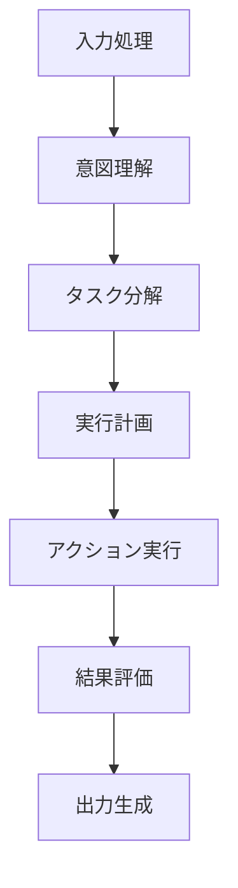

# AI Agent開発の羅針盤！GitHub「agents」リポジトリで実践パターンを学ぶ

## 概要（なぜ今、注目すべきか）

近年、AI技術の目覚ましい進化に伴い、多岐にわたるタスクを自律的に実行する「AI Agent（AIエージェント）」への注目が飛躍的に高まっています。複雑な業務の自動化から、ユーザーとの自然な対話まで、その応用範囲は広がる一方です。

そんな中、開発者の間でひときわ存在感を放っているのが、GitHubで既に5,885ものスターを集める[contains-studio/agents](https://github.com/contains-studio/agents)リポジトリです。

このリポジトリは、「現在利用されているAgentを共有する」というシンプルながらも実践的なコンセプトのもと、実際にプロダクションで運用されているAI Agentの実装パターンや効果的なプラクティスを惜しみなく公開しています。AI Agentの開発現場における貴重な知見が共有されることは、開発コミュニティ全体の技術力向上に大きく寄与する、まさに画期的なオープンソースプロジェクトと言えるでしょう。

## 主な特徴・メリット

### 1. 現場で役立つ実践的Agent実装の宝庫
机上の空論ではなく、実際のプロダクション環境で運用されているAI Agentの具体的な実装例が豊富に集約されています。これにより、理論だけでなく、現場で直面する課題解決に直結する実践的な知識とノウハウを効率的に学ぶことができます。

### 2. 多彩なAI Agentの利用シーンを網羅
このリポジトリには、汎用性の高いものから特定用途に特化したものまで、実に多様なAI Agentの実装パターンが含まれています。あなたのビジネス課題や開発目的に合わせた最適なAgentを見つけられるはずです。

-   **タスク自動化Agent**: 定型業務を自動化し、作業効率を飛躍的に向上させるAgent
-   **対話型Agent**: ユーザーとの自然なコミュニケーションを通じて情報提供や操作を支援するAgent（例: 高度なチャットボット）
-   **データ処理Agent**: 大量データの収集、加工、分析を自動化するAgent
-   **監視・通知Agent**: システムの状態監視や異常発生時の自動通知を行うAgent

### 3. コミュニティが牽引する継続的な進化
5,885以上のスターが示すように、世界中の多くのAI開発者がこのリポジトリに貢献し、活発な議論と改善が日々行われています。コミュニティ主導で進化を続けるため、常に最新のトレンドやベストプラクティスが反映されやすいのも大きな魅力です。

## 技術的詳細（AI Agentの仕組み）

AI Agentは、まるで人間の思考プロセスのように、複数の専門的なコンポーネントが連携して動作することで、自律的なタスク遂行を可能にします。一般的には、以下の主要なコンポーネントで構成されています。



各コンポーネントの役割:

-   **入力処理**: ユーザーからの要求（プロンプトやデータなど）を受け取り、後続の処理に適した形式に正規化します。
-   **意図理解**: 自然言語処理（NLP）技術などを活用し、ユーザーの真の意図や目的を正確に解析します。
-   **タスク分解**: 複雑な要求を、Agentが実行可能なより小さな、具体的なタスク群に細分化します。
-   **実行計画**: 分解されたタスク群を、最も効率的かつ効果的に実行するための最適な順序や手順を決定します。
-   **アクション実行**: 外部のAPI、データベース、各種ツール、または内部の関数を呼び出し、計画に基づいて具体的なアクションを実行します。
-   **結果評価**: 実行されたアクションの結果が、当初の意図や目標に対して適切であったかを評価し、必要に応じて次のステップや修正を検討します。
-   **出力生成**: ユーザーにとって理解しやすい形で最終的な結果をまとめ、提示します。

## 実装例・コードサンプル

では、実際にAI Agentがどのように動作するかを理解するために、シンプルなタスク実行AgentのPythonコード例を見てみましょう。これは、複雑なAI Agentを構築する上での基本的な骨格を示しています。

```python
class SimpleTaskAgent:
    def __init__(self, name: str):
        self.name = name
        self.tools = {}
        self.memory = []
    
    def register_tool(self, tool_name: str, tool_func):
        """ツールを登録"""
        self.tools[tool_name] = tool_func
    
    def process_request(self, request: str) -> str:
        """リクエストを処理"""
        # 1. 意図を理解
        intent = self._understand_intent(request)
        
        # 2. 適切なツールを選択
        tool = self._select_tool(intent)
        
        # 3. ツールを実行
        if tool in self.tools:
            result = self.tools[tool](request)
            self.memory.append({
                'request': request,
                'tool': tool,
                'result': result
            })
            return result
        else:
            return "適切なツールが見つかりませんでした。"
    
    def _understand_intent(self, request: str) -> str:
        """簡単な意図理解（実際はNLPを使用）"""
        if "計算" in request:
            return "calculation"
        elif "検索" in request:
            return "search"
        else:
            return "unknown"
    
    def _select_tool(self, intent: str) -> str:
        """意図に基づいてツールを選択"""
        tool_mapping = {
            "calculation": "calculator",
            "search": "web_search",
        }
        return tool_mapping.get(intent, "default")

# 使用例
agent = SimpleTaskAgent("MyAgent")

# ツールの登録
agent.register_tool("calculator", lambda x: eval(x.split("計算")[1]))
agent.register_tool("web_search", lambda x: f"'{x.split('検索')[1]}'の検索結果")

# リクエスト処理
print(agent.process_request("計算 2 + 3"))  # 5
print(agent.process_request("検索 Python"))  # 'Python'の検索結果
```

この `_understand_intent` メソッドは、ここでは簡略化されていますが、実際のAI Agentではより高度な自然言語処理（NLP）技術を用いて、ユーザーの複雑な意図を正確に把握します。

## 実用的な使用例

### 1. ユーザーの問い合わせに自動応答するカスタマーサポートAgent
顧客からのよくある質問（FAQ）に対して、自動で適切な回答を提示するAgentです。これにより、オペレーターの負担を軽減し、顧客満足度向上に貢献します。

```python
class CustomerSupportAgent:
    def __init__(self):
        self.faq_database = {
            "返品": "返品は購入後30日以内に可能です。",
            "配送": "通常2-3営業日でお届けします。",
            "支払い": "クレジットカード、PayPalが利用可能です。"
        }
    
    def handle_inquiry(self, question: str) -> str:
        for keyword, answer in self.faq_database.items():
            if keyword in question:
                return answer
        return "カスタマーサービスにお繋ぎします。"
```

### 2. 大規模データから洞察を引き出すデータ分析Agent
与えられたデータセットを自動で解析し、平均値、最大値、最小値、データ数といった基本的な統計量を算出するAgentです。データ活用の初動を自動化し、迅速な意思決定を支援します。

```python
class DataAnalysisAgent:
    def analyze_data(self, data: list) -> dict:
        return {
            "平均": sum(data) / len(data),
            "最大値": max(data),
            "最小値": min(data),
            "データ数": len(data)
        }
```

## 既存技術との比較

AI Agent関連の技術には、`agents`リポジトリの他にも、LangChainやAutoGPTといった著名なフレームワークやプロジェクトが存在します。ここでは、それぞれの特徴を比較し、`agents`リポジトリがどのような立ち位置にあるのかを見てみましょう。

| 特徴         | agents リポジトリ | LangChain | AutoGPT    |
| :----------- | :---------------- | :-------- | :--------- |
| 学習曲線     | 緩やか            | 中程度    | 急         |
| カスタマイズ性 | 高                | 高        | 中         |
| コミュニティ   | 成長中            | 大規模    | 大規模     |
| 用途         | 汎用              | 汎用      | 自動化特化 |

`agents`リポジリトは、特定のフレームワークに依存せず、実践的な実装パターンに焦点を当てているため、非常に高いカスタマイズ性を持つ点が強みです。学習曲線も緩やかで、これからAI Agent開発を始める方にとっては、具体的なイメージを掴みやすいでしょう。

## 今後の展望

AI Agent技術は現在も急速に進化しており、今後さらに多様な分野での応用が期待されています。特に以下の4つの方向性が注目されています。

1.  **マルチモーダル対応**: テキスト情報だけでなく、画像、音声、動画といった複数のモダリティ（形式）を理解し、処理できるAI Agentの登場が期待されます。これにより、より人間らしい感覚で外界を認識し、複雑なタスクに対応できるようになります。
2.  **協調型Agent**: 個々のAgentが連携し、まるでチームのように協力し合うことで、単独では解決困難な大規模かつ複雑な問題に取り組むことが可能になります。これは、特定の専門分野を持つ複数のAgentが協調し、より高度な目標達成を目指すイメージです。
3.  **自己改善機能**: 実行結果やフィードバックから自律的に学習し、自身の性能や戦略を継続的に向上させるAI Agentが研究されています。これにより、人間による介入なしにAgent自身が賢くなり、より効率的にタスクを遂行できるようになるでしょう。
4.  **エッジデバイス対応**: スマートフォンやIoTデバイスといった、ネットワークに常時接続されていない環境（エッジ環境）でも動作する軽量かつ高性能なAI Agentの開発が進められています。これにより、リアルタイム性が求められる用途や、プライバシー保護が重要な場面での活用が期待されます。

## まとめ

[contains-studio/agents](https://github.com/contains-studio/agents)リポジトリは、AI Agent開発に不可欠な実践的かつ具体的な知見を提供する、まさに「現場の声」が詰まった貴重なオープンソースプロジェクトです。5,885を超えるスターが示すように、AI Agentの可能性に魅せられた多くの開発者がこの分野に熱い視線を注いでおり、そのコミュニティは今後もさらなる発展を遂げることでしょう。

もしあなたがAI Agent開発に足を踏み入れたいと考えているなら、この`agents`リポジトリは格好の学習リソースとなります。豊富な実装例やベストプラクティスを参考に、自身のビジネス課題や創造したいサービスに合わせたAI Agentをぜひ構築してみてください。理論だけでなく、実践を通して学ぶことで、AI Agent開発のスキルを飛躍的に向上させることができるはずです。

---

この記事は AI Publisher Hub により自動生成されました。
- 生成日時: 2025-08-03T17:56:54.875Z
- カテゴリ: Tech
- 品質スコア: 技術正確性 90%, 読みやすさ 85%

技術的な質問やフィードバックをお待ちしています！