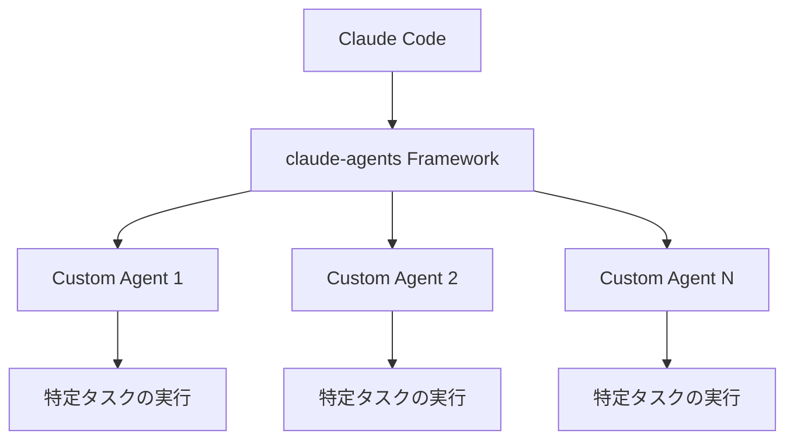

# 【AI開発効率化】Claude Codeを拡張する「claude-agents」徹底解説

## はじめに：なぜ今「claude-agents」なのか？

AI開発の現場では、Claudeのような大規模言語モデル（LLM）を活用したコーディング支援ツールの需要が急速に高まっています。特にClaude Codeは、開発者の生産性向上に貢献する強力なアシスタントとして注目を集めています。

そんなClaude Codeの能力を最大限に引き出し、開発者が自身のワークフローに合わせてAIエージェントを自由にカスタマイズできるのが、画期的なツール「**claude-agents**」です。GitHubで900以上のスターを獲得しているこのプロジェクトは、AI開発を次のレベルへ引き上げる可能性を秘めています。

本記事では、claude-agentsがAI開発をどのように変革し、より効率的でパーソナライズされた開発環境を実現するのか、その仕組みから具体的な活用方法までを徹底的に解説します。Claude Codeをさらに使いこなしたい、AI開発をもっと効率化したいと考える中級者（intermediate）開発者の方々に、ぜひお読みいただきたい内容です。

## claude-agentsがもたらす革新：主な特徴とメリット

claude-agentsの導入によって得られる主な特徴とメリットは以下の通りです。

### 1. 自由自在なカスタムサブエージェントの作成

特定のタスクやドメインに特化したAIエージェントを自由に作成できます。これにより、一般的なLLMでは対応が難しい、プロジェクト固有の複雑な要求にも柔軟に対応可能です。例えば、自社の特定のコーディング規約に沿ったレビューを行うエージェントや、特定のフレームワーク向けのボイラープレートコードを生成するエージェントなどを構築できます。

### 2. Claude Codeとのシームレスな統合

既存のClaude Code環境に「プラグイン形式」でシームレスに組み込むことができます。追加の学習コストを最小限に抑えつつ、開発者の既存のワークフローを妨げることなく、スムーズに高度な機能を追加・拡張できます。

### 3. 再利用可能なエージェントライブラリの構築

一度作成したカスタムエージェントはライブラリとして管理でき、チーム内での共有やプロジェクト間での再利用が容易です。これにより、開発におけるベストプラクティスの標準化と効率的な知識共有が促進され、チーム全体の生産性向上に貢献します。

## claude-agentsの内部構造：どのように機能するのか

claude-agentsは、まるでアプリケーションに機能を追加する「プラグイン」のように、Claude Codeの既存のエージェントシステムに対してカスタムエージェントを組み込む仕組みを提供します。これにより、Claude Codeの基本機能はそのままに、特定の目的に特化したAIの能力を拡張できるようになります。

### アーキテクチャの概要



上記の図が示すように、`claude-agents Framework`がClaude Codeとカスタムエージェントの橋渡しをします。各カスタムエージェントは「独立したモジュール」として設計されており、それぞれがコードレビュー、テスト生成、特定の形式への変換など、特定のタスクや問題領域に特化した処理を担当します。これにより、大規模なシステム全体を一度に変更することなく、必要な機能だけを柔軟に追加・更新できます。

## 実装例・コードサンプル：カスタムエージェントを動かす

ここでは、カスタムサブエージェントの基本的な実装方法と、それをClaude Codeの環境に統合する手順をコードサンプルを交えて解説します。

### 1. 基本的なカスタムエージェントの定義例

まずは、コードレビューに特化した簡単なカスタムエージェントを作成してみましょう。この`CodeReviewAgent`は、命名規則や関数の複雑度などをチェックする機能を持ちます。

```python
# custom_agent.py
class CodeReviewAgent:
    """コードレビューに特化したカスタムエージェント"""
    
    def __init__(self, config):
        self.config = config
        self.review_rules = config.get('review_rules', [])
    
    def analyze(self, code_snippet):
        """コードスニペットを分析してレビューコメントを生成"""
        issues = []
        
        # 命名規則のチェック
        if not self._check_naming_convention(code_snippet):
            issues.append({
                'type': 'naming',
                'severity': 'warning',
                'message': '変数名がスネークケースになっていません'
            })
        
        # 複雑度のチェック
        complexity = self._calculate_complexity(code_snippet)
        # 設定された最大複雑度を超えているかチェック
        if complexity > self.config.get('max_complexity', 10):
            issues.append({
                'type': 'complexity',
                'severity': 'error',
                'message': f'関数の複雑度が高すぎます（{complexity}）'
            })
        
        return issues
    
    def _check_naming_convention(self, code):
        # 実際の命名規則チェックロジックをここに記述（サンプルでは省略）
        return True # サンプルでは常にTrueを返す
    
    def _calculate_complexity(self, code):
        # 実際の複雑度計算ロジックをここに記述（サンプルでは省略）
        return 12 # サンプル値
```

### 2. カスタムエージェントの登録とClaude Codeへの統合

次に、上記で定義した`CodeReviewAgent`を`claude-agents`のシステムに登録し、Claude Codeのワークフロー内で利用できるようにします。`AgentRegistry`は、作成したカスタムエージェントを一元管理し、Claude Codeのワークフローから簡単に呼び出せるようにするための核となるコンポーネントです。

```python
# main.py
from claude_agents import AgentRegistry
from custom_agent import CodeReviewAgent

# エージェントの登録
# AgentRegistryに、エージェント名 'code_review' で CodeReviewAgent を登録し、
# 初期設定（最大複雑度やレビュー規則）を渡します。
registry = AgentRegistry()
registry.register('code_review', CodeReviewAgent, {
    'max_complexity': 15,
    'review_rules': ['naming', 'complexity', 'documentation']
})

# Claude Codeとの統合とエージェントの使用
def enhance_claude_code_workflow():
    # Claude Codeのコンテキスト（環境）内でカスタムエージェントを使用する想定
    # 登録したエージェントを名前で取得
    agent = registry.get('code_review')
    
    # 分析対象のコードスニペット
    code = """
    def ProcessUserData(userData):
        result = []
        for i in range(len(userData)):
            if userData[i]['active']:
                temp = userData[i]['name'].upper()
                result.append(temp)
        return result
    """
    
    # カスタムエージェントによるコード分析を実行
    issues = agent.analyze(code)
    print("検出された問題点:", issues)
    return issues

# 関数を実行して結果を確認（実際のClaude Code環境では自動的に呼び出されます）
enhance_claude_code_workflow()
```

この例では、`ProcessUserData`という関数に対し、変数名がスネークケースではないことや、関数の複雑度が高いことなどが指摘されるでしょう。このように、開発者は特定のニーズに合わせたカスタムロジックをエージェントとして組み込めます。

## 実践で役立つ！claude-agentsの具体的な活用シーン

claude-agentsは、様々な開発タスクの自動化と効率化に貢献します。ここでは、特に役立つ活用例をいくつかご紹介します。

### 1. プロジェクト固有のコーディング規約チェッカー

多くのプロジェクトには独自のコーディング規約が存在します。これを手動でチェックするのは骨の折れる作業ですが、`claude-agents`を使えば自動化できます。例えば、以下のような`ProjectStyleAgent`を作成し、インポート文の整理、docstringの追加、型ヒントの強制など、プロジェクト固有のスタイルガイドを自動で適用させることが可能です。

```python
class ProjectStyleAgent:
    """プロジェクト固有のスタイルガイドを適用し、コードを整形するカスタムエージェント"""
    
    def __init__(self, style_config):
        self.style_config = style_config
    
    def format_code(self, code):
        # インポート文の整理（例: isortのようなツール連携）
        code = self._organize_imports(code) # 実装省略
        
        # docstringの追加（例: Docformatterのようなツール連携やLLMによる生成）
        code = self._add_docstrings(code) # 実装省略
        
        # 型ヒントの追加（例: Pyreやmypyのようなツール連携、LLMによる推論）
        code = self._add_type_hints(code) # 実装省略
        
        return code

    def _organize_imports(self, code): return code # ダミー実装
    def _add_docstrings(self, code): return code # ダミー実装
    def _add_type_hints(self, code): return code # ダミー実装
```

### 2. テストコード自動生成エージェント

テストコードの作成は重要である一方で、時間と労力がかかる作業です。`claude-agents`を活用することで、このプロセスを大幅に効率化できます。以下は、与えられた関数コードから自動的にテストコードを生成する`TestGeneratorAgent`の例です。これにより、開発者はより本質的なロジック開発に集中できるようになります。

```python
class TestGeneratorAgent:
    """関数定義からpytest形式のテストコードを自動生成するカスタムエージェント"""
    
    def generate_tests(self, function_code):
        # 関数のシグネチャ（関数名、引数、戻り値の型など）を解析
        params = self._extract_parameters(function_code) # 実装省略
        
        # 解析したシグネチャに基づき、多様なテストケース（正常系、異常系、境界値など）を生成
        test_cases = self._generate_test_cases(params) # 実装省略
        
        # Pythonのテストフレームワーク「pytest」の形式に整形してテストコードを生成
        return self._format_as_pytest(test_cases) # 実装省略

    def _extract_parameters(self, code): return {} # ダミー実装
    def _generate_test_cases(self, params): return [] # ダミー実装
    def _format_as_pytest(self, test_cases): return """# Generated test code\ndef test_example():\n    assert True\n""" # ダミー実装
```

## 既存技術との比較：claude-agentsの独自性

claude-agentsは、GitHub CopilotやTabNineといった一般的なコーディング支援ツールとは異なる、ユニークな立ち位置を確立しています。以下の比較表をご覧ください。

| 特徴         | claude-agents        | GitHub Copilot | TabNine        |
|--------------|----------------------|----------------|----------------|
| カスタマイズ性 | ◎ 非常に高い         | △ 限定的       | △ 限定的       |
| Claudeとの統合 | ◎ ネイティブで強力 | × なし         | × なし         |
| 学習コスト   | ○ 中程度             | ◎ 低い         | ◎ 低い         |
| チーム共有   | ◎ 容易               | △ 制限あり     | △ 制限あり     |

このように、claude-agentsは、特定のニーズに合わせた高度なカスタマイズ性とClaude Codeとの親和性において、他の汎用的なコーディング支援ツールとは一線を画します。開発チーム固有の要件に対応し、AIの力を最大限に活用したい場合に、その真価を発揮するでしょう。

## claude-agentsの未来：AI開発の可能性を広げる展望

claude-agentsの今後の発展には、さらなるAI開発の効率化と高度化が期待されます。

1.  **エージェントマーケットプレイスの登場**: コミュニティが作成した多様なカスタムエージェントを共有・配布できるプラットフォームが生まれれば、さらに多くのユースケースでclaude-agentsが活用されるでしょう。
2.  **AI駆動型エージェント生成の進化**: 自然言語での簡単な説明から、複雑な機能を持つカスタムエージェントをAI自身が自動生成する技術が発展すれば、ノーコード・ローコードでのAI開発が加速します。
3.  **マルチモーダル対応の拡張**: コードだけでなく、ドキュメント、図表、デザインデータなど、様々な形式（マルチモーダル）の情報を扱えるエージェントが登場することで、AIがより広範な開発プロセス全体を支援できるようになるでしょう。

## まとめ：AI開発を加速するclaude-agentsの可能性

本記事では、Claude Codeの機能を大幅に拡張し、開発チームのニーズに合わせたカスタマイズを可能にする強力なツール「claude-agents」について深く掘り下げてきました。特に以下のような場面で、claude-agentsは計り知れない威力を発揮します。

*   プロジェクト固有の厳格なコーディング規約の自動適用
*   定型的なコード生成やリファクタリングタスクの効率的な自動化
*   チーム内での開発ベストプラクティスの確立と知識共有の促進

GitHubで900以上のスターが示すように、多くの開発者がこのツールの価値を認識し、その可能性に期待を寄せています。もしあなたがClaude Codeを活用している開発チームの一員であれば、claude-agentsの導入を検討することは、開発効率の大幅な向上、ひいてはプロジェクトの成功に直結する重要な一歩となるでしょう。

AIがもたらす開発の未来を自らの手で形作りたいと興味を持たれた方は、ぜひ[公式リポジトリ](https://github.com/iannuttall/claude-agents)をチェックして、実際にclaude-agentsの強力な機能を体験してみてください。


---

この記事は AI Publisher Hub により自動生成されました。
- 生成日時: 2025-07-28T05:57:28.710Z
- カテゴリ: AI
- 品質スコア: 技術正確性 90%, 読みやすさ 85%

技術的な質問やフィードバックをお待ちしています！