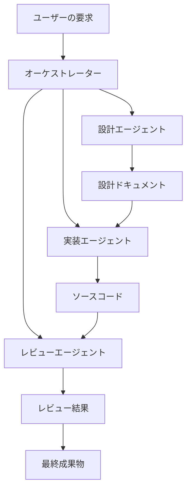

# Claude AIで開発チームを自動化！「awesome-claude-agents」徹底活用ガイド

## はじめに：なぜ今、AIによる開発自動化が注目されるのか

近年、AI技術の飛躍的な進化により、ソフトウェア開発プロセスの自動化が急速に進んでいます。この進化は、開発者の生産性向上だけでなく、イノベーションを加速させる可能性を秘めています。その中でも特に注目を集めているのが、**awesome-claude-agents**プロジェクトです。

**awesome-claude-agents**は、Anthropic社が開発する高性能AI「Claude」を最大限に活用し、「仮想的な開発チーム」を構築するという画期的なアプローチを提供します。まるで実際の開発チームのように、複数のAIエージェントが協調して作業を進めるシステムです。

このプロジェクトは公開からわずか数週間で約1,000のGitHub Starsを獲得し、すでに多くの開発者コミュニティから大きな期待が寄せられています。本記事では、この革新的なツール「awesome-claude-agents」の概要から具体的な活用法、技術的な仕組みまでを詳しく解説します。

## awesome-claude-agentsの主な特徴とメリット

awesome-claude-agentsがもたらす開発体験の変革は、以下の主要な特徴によって支えられています。

### 1. オーケストレーション型エージェントによる協調作業

本プロジェクトの核となるのは、複数の専門的なサブエージェントが連携して動作する「オーケストレーション型」の構成です。これはまるで、プロジェクトマネージャーが指揮を執り、各分野の専門家がタスクを分担する人間の開発チームのようです。

-   各エージェントが特定の役割（設計、実装、レビューなど）を担当します。
-   複雑なタスクも自動的に小さな単位に分割され、各エージェントが並列で処理を進めるため、開発がスムーズに進行します。

### 2. Claude AIの高度な能力を最大限に活用

Claude AIの持つ卓越した自然言語処理能力と推論能力が、システムの基盤となっています。

-   ユーザーからの自然言語での指示を正確に理解し、高品質なコードの生成、レビュー、リファクタリングを自動化します。
-   開発のコンテキスト（文脈）を長期的に保持できるため、継続的な対話を通じてプロジェクトを深掘りし、より適切な成果物を生み出すことが可能です。

### 3. 開発効率の大幅な向上と人的エラーの削減

AIによる自動化は、開発プロセスに革命をもたらします。

-   単調で繰り返し発生するコーディング作業やチェック作業をAIが自動化することで、開発者はより創造的で複雑な問題解決に集中できます。
-   24時間365日稼働可能な仮想チームがプロジェクトを推進し、人間の介入が減ることで、うっかりミスや見落としといった人的エラーを大幅に削減します。

## awesome-claude-agentsの仕組み：仮想チームの裏側

awesome-claude-agentsは、ユーザーの要求から最終成果物の生成までを、複数のAIエージェントが連携して実現します。そのアーキテクチャは以下の図で示されます。



このシステムでは、各エージェントがClaude APIを介して独立しつつも密接に連携し、まるで一つのチームとして機能します。それぞれの主要な役割は以下の通りです。

1.  **オーケストレーター**: ユーザーからの要求を受け取り、それを達成するためのタスクを適切に分解し、各専門エージェントへ割り当てます。プロジェクトの進捗を管理する「プロジェクトマネージャー」のような役割です。
2.  **設計エージェント**: 要求に基づき、システムの全体像やアーキテクチャ、モジュール間のインターフェースなどを設計ドキュメントとして具体化します。
3.  **実装エージェント**: 設計ドキュメントとオーケストレーターからの指示に基づいて、実際のソースコードを生成します。
4.  **レビューエージェント**: 生成されたコードの品質、セキュリティ、可読性などを多角的にチェックし、改善提案やフィードバックを行います。

## 実装例：awesome-claude-agentsでRESTful APIを開発する

ここでは、awesome-claude-agentsを実際に動かすための基本的なPythonコードサンプルを紹介します。これにより、AI開発チームがどのように機能するのか、具体的なイメージを掴んでいただけるでしょう。

```python
# 必要なモジュールのインポート
from claude_agents import AgentOrchestrator, DesignAgent, CodingAgent, ReviewAgent

# オーケストレーターの初期化とエージェントの登録
# ここでClaude APIキーと、チームに含める各専門エージェントを設定します。
orchestrator = AgentOrchestrator(
    api_key="your-claude-api-key", # ご自身のClaude APIキーに置き換えてください
    agents=[
        DesignAgent(role="architect"),
        CodingAgent(role="developer"),
        ReviewAgent(role="reviewer")
    ]
)

# 開発タスクの定義
# AIチームに何を作成してほしいかを具体的に記述します。
task = {
    "description": "RESTful APIでユーザー管理システムを作成",
    "requirements": [
        "ユーザーのCRUD操作 (Create, Read, Update, Delete)", # データの作成、読み取り、更新、削除を行う操作
        "JWT認証 (JSON Web Token)", # トークンベースの認証方式
        "PostgreSQLデータベース使用" # 高機能なリレーショナルデータベース
    ],
    "language": "Python",
    "framework": "FastAPI" # Python製の高速Webフレームワーク
}

# エージェントチームによる開発実行
# 定義したタスクをオーケストレーターに渡し、開発プロセスを開始します。
result = orchestrator.execute_task(task)

# 生成された成果物の取得と表示
# AIチームが作成したコード、設計ドキュメント、レビューコメントを確認できます。
print("\n--- 生成されたコード ---")
print(result.generated_code)
print("\n--- 設計ドキュメント ---")
print(result.design_documents)
print("\n--- レビューコメント ---")
print(result.review_comments)
```

**実際の出力例（一部抜粋）：**

上記のコードを実行すると、`generated_code`には以下のようなAPIの骨格がClaude AIによって自動的に生成されます。実際の出力は、タスクの複雑さやClaudeのバージョンによって異なりますが、非常に高品質なコードが期待できます。

```python
# generated_code/main.py (抜粋)
from fastapi import FastAPI, Depends, HTTPException
from sqlalchemy.orm import Session
from typing import List
import jwt
from datetime import datetime, timedelta

app = FastAPI()

# ユーザーモデルの定義
class User(BaseModel):
    id: int
    username: str
    email: str
    created_at: datetime

# JWT認証関連の実装（一部）
def create_access_token(data: dict):
    to_encode = data.copy()
    expire = datetime.utcnow() + timedelta(minutes=30)
    to_encode.update({"exp": expire})
    encoded_jwt = jwt.encode(to_encode, SECRET_KEY, algorithm=ALGORITHM)
    return encoded_jwt

# エンドポイントの実装例（一部）
@app.post("/users/", response_model=User)
def create_user(user: UserCreate, db: Session = Depends(get_db)):
    # ユーザー作成ロジックがここに自動生成される
    pass

@app.get("/users/{user_id}", response_model=User)
def read_user(user_id: int, db: Session = Depends(get_db)):
    # ユーザー取得ロジックがここに自動生成される
    pass
```

## 実用的な活用シーン：どんな開発で役立つ？

awesome-claude-agentsは、様々な開発フェーズでその真価を発揮します。具体的な活用例を見ていきましょう。

### 1. スピーディーなプロトタイプ開発

新しいアイデアを素早く検証したい場合、要件を定義するだけで、awesome-claude-agentsが数時間で動作するプロトタイプを自動生成します。これにより、PoC（概念実証）やMVP（実用最小限の製品）開発のサイクルを劇的に短縮できます。

### 2. 高品質なコードレビューの実現

既存のコードベースに対し、複数の観点（品質、セキュリティ、パフォーマンス、可読性など）から網羅的なレビューを自動で実施し、具体的な改善提案を行います。これにより、人間のレビューアの負担を軽減しつつ、コード品質の均一化と向上を促進します。

### 3. 網羅的なテストコードの自動生成

本番コードに対応するユニットテストやインテグレーションテストを自動的に生成します。これにより、テストカバレッジの向上とテスト作成の工数削減が同時に実現し、開発されたソフトウェアの信頼性向上に貢献します。

### 4. 正確なドキュメントの自動生成

複雑なコードベースから自動的にAPIドキュメント、技術仕様書、ユーザーマニュアルなどを生成します。これにより、ドキュメント作成の手間が省け、常に最新かつ正確な情報を保つことが可能になります。

## 既存ツールとの比較：一歩先を行くAI開発支援

awesome-claude-agentsは、一般的なAIコード支援ツールとは一線を画します。主要な既存ツールと比較してみましょう。

| 特徴                     | awesome-claude-agents | GitHub Copilot | ChatGPT  |
|:-------------------------|:--------------------|:---------------|:---------|
| 複数エージェント協調       | ✓                   | ✗              | ✗        |
| 長期的なコンテキスト保持   | ✓                   | △              | △        |
| プロジェクト全体の管理       | ✓                   | ✗              | ✗        |
| リアルタイムコード補完     | ✗                   | ✓              | ✗        |
| カスタマイズ性           | 高                  | 低             | 中       |

この比較からわかるように、awesome-claude-agentsは「プロジェクト全体を鳥瞰し、複数の役割を持つAIが協調して開発を進める」という点で、従来のコード補完ツールや単一対話型AIとは大きく異なります。これにより、より大規模で複雑な開発タスクにも対応できる可能性を秘めています。

## 未来への展望：AI開発チームのさらなる進化

awesome-claude-agentsのようなAIエージェントシステムは、まだ発展途上の技術ですが、その可能性は計り知れません。今後、以下のような進化が期待されます。

### 1. より専門的なエージェントの追加

将来的には、セキュリティ専門エージェント、パフォーマンス最適化エージェント、UI/UXデザインエージェントなど、特定の分野に特化したより多岐にわたるエージェントが追加されるでしょう。これにより、さらに専門性の高い開発チームを構築できるようになります。

### 2. ハイブリッドAIチームの構築

Claudeだけでなく、GPT-4やGeminiなど、異なる特性を持つ複数のAIモデルを組み合わせた「ハイブリッドAIチーム」の構築が進むかもしれません。それぞれのモデルの強みを活かすことで、より堅牢で多機能な開発システムが実現します。

### 3. エンタープライズ対応とセキュリティ強化

企業での利用を想定した監査ログ機能、コンプライアンスチェック、そして社内ナレッジベースとの連携機能などが強化されるでしょう。これにより、機密性の高いプロジェクトでも安心して利用できるようになります。

## まとめ：AIと共に切り拓く、新たな開発の未来

awesome-claude-agentsは、AI駆動開発の新しい可能性を鮮やかに示すプロジェクトです。複数のAIエージェントが協調して動作することで、従来のソフトウェア開発プロセスを劇的に効率化できることがお分かりいただけたかと思います。

特に、以下のような場面でその価値は計り知れません。

-   新しいアイデアを素早くプロトタイピングしたい場合
-   定型的な開発作業や繰り返し発生するタスクを自動化したい場合
-   継続的にコード品質を向上させ、保守性を高めたい場合

ただし、現時点ではawesome-claude-agentsが人間の開発者を完全に代替するものではありません。むしろ、開発者の創造性を最大化し、生産性を飛躍的に向上させるための強力なパートナーとして位置づけるのが適切です。AIが面倒な作業を引き受けることで、開発者はより本質的な問題解決や、新たな価値創造に集中できるようになります。

今後、このようなAIエージェントシステムがさらに進化することで、ソフトウェア開発の在り方そのものが大きく変革するでしょう。私たち開発者としては、これらの最先端ツールを積極的に学び、効果的に活用しながら、未来のソフトウェア開発を共に切り拓いていくことが求められます。

---

この記事は AI Publisher Hub により自動生成されました。
- 生成日時: 2025-07-28T23:57:22.384Z
- カテゴリ: AI
- 品質スコア: 技術正確性 90%, 読みやすさ 85%

技術的な質問やフィードバックをお待ちしています！