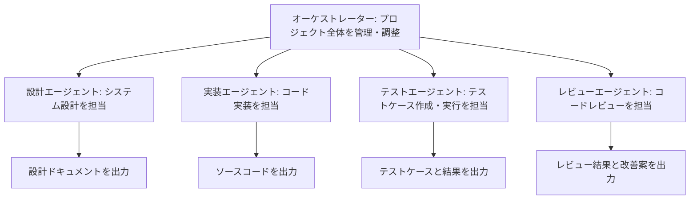

# Claude AIで開発を自動化！マルチエージェント「awesome-claude-agents」徹底解説

## 概要：なぜ今、AIエージェントによる開発自動化が注目されるのか

近年、ソフトウェア開発の現場では、AIエージェントを活用した自動化が大きな注目を集めています。中でも、Anthropic社が開発した高性能AI「Claude」を基盤とする「awesome-claude-agents」は、複数のAIサブエージェントが連携し、まるで人間の開発チームのように協調してタスクを遂行するという画期的なアプローチを提供しています。

このプロジェクトは、すでにGitHubで2,300以上のスターを獲得しており、その革新性が広く認められています。単一のAIエージェントが孤立して作業するのではなく、それぞれが特定の役割（設計、実装、テスト、レビューなど）に特化し、協力し合うことで、より複雑で高度な開発作業の自動化を実現します。

## awesome-claude-agentsの主な特徴とメリット

awesome-claude-agentsがもたらす開発自動化の新たな可能性は、以下の特徴に集約されます。

### 1. オーケストレーション型アーキテクチャ
まるで指揮者のように全体の流れを統括する「オーケストレーター」が、複数のClaude AIエージェントを調整します。各エージェントはそれぞれ異なる専門分野（設計、実装、テスト、レビューなど）を担当し、互いに連携しながらプロジェクトを推進します。

### 2. 役割ベースの専門化
各エージェントは特定の開発タスクに特化しているため、その分野における深い知識と高い精度で成果物を生成できます。これにより、個々の作業品質が向上し、全体としての開発効率と品質が高まります。

### 3. 柔軟な拡張性
システムの設計上、新しいエージェントの追加や既存エージェントのカスタマイズが容易に行えます。これにより、プロジェクトの要件や組織のニーズに合わせて、柔軟に開発チームの構成を最適化することが可能です。

### 4. 自動化された開発フロー
要件定義からシステム設計、実装、テスト、さらにはコードレビューに至るまで、ソフトウェア開発の一連のプロセスを自動化できます。これにより、開発サイクル全体の効率化と迅速化が期待できます。

## 技術的詳細：仕組みの解説

awesome-claude-agentsは、以下のような構造で動作し、各エージェントが連携して開発タスクを遂行します。



各エージェントは独立したClaude APIインスタンスとして機能し、自身の専門分野のタスクに集中します。そして、中央の「オーケストレーター」が、各エージェント間のコミュニケーションを調整し、タスクの割り当てや進捗管理を行い、プロジェクト全体を円滑に進めます。

## 実装例・コードサンプル：Claude AI開発チームを動かす

ここでは、awesome-claude-agentsを用いた基本的な開発フローの実装例をご紹介します。Pythonコードを通じて、AIエージェントたちがどのように連携してプロジェクトを進めるのかを具体的に見ていきましょう。

```python
from claude_agents import Orchestrator, DesignAgent, CodingAgent, TestAgent

# 1. オーケストレーターの初期化
orchestrator = Orchestrator(
    api_key="your-claude-api-key", # Claude APIキーを設定
    model="claude-3-opus-20240229"  # 使用するClaudeモデルを指定（高性能なOpus推奨）
)

# 2. 専門性を持つエージェントの設定
design_agent = DesignAgent(
    role="システム設計担当",
    expertise=["アーキテクチャ設計", "API設計"] # 設計に関する専門知識
)

coding_agent = CodingAgent(
    role="実装担当",
    languages=["Python", "JavaScript"], # 対応言語
    frameworks=["FastAPI", "React"]       # 対応フレームワーク
)

test_agent = TestAgent(
    role="テスト担当",
    test_types=["単体テスト", "統合テスト"]  # 対応テストタイプ
)

# 3. エージェントをオーケストレーターに登録
orchestrator.register_agent(design_agent)
orchestrator.register_agent(coding_agent)
orchestrator.register_agent(test_agent)

# 4. プロジェクトの要件定義と実行
project_requirements = """
ユーザー認証機能を持つRESTful APIを開発してください。
- JWT認証を使用
- ユーザー登録、ログイン、プロフィール更新機能
- PostgreSQLデータベースを使用
"""

# オーケストレーターがエージェントを指揮し、プロジェクトを実行
result = orchestrator.execute_project(project_requirements)

# 5. 生成された成果物の取得
print("--- 設計ドキュメント ---", result.design_docs)
print("--- ソースコード ---", result.source_code)
print("--- テストケース ---", result.test_cases)
```

このコードを実行すると、`awesome-claude-agents`が与えられた要件に基づき、自動的に設計ドキュメント、ソースコード、テストケースを生成します。まるで社内にAI開発チームがいるかのように、一連の作業が自動で進んでいく様子を体験できるでしょう。

## 実用的な活用例：開発現場での応用シナリオ

awesome-claude-agentsは、様々な開発シーンでその真価を発揮します。

### 1. マイクロサービスの自動生成
複雑なマイクロサービスアーキテクチャも、仕様を定義するだけで自動生成が可能です。例えば、決済サービスに必要なAPIエンドポイントやデータベース、メッセージキューなどの情報を与えるだけで、自動でコードベースを構築してくれます。

```python
# マイクロサービス生成の例
microservice_spec = {
    "name": "payment-service",
    "endpoints": [
        {"method": "POST", "path": "/payments", "description": "決済処理"},
        {"method": "GET", "path": "/payments/{id}", "description": "決済情報取得"}
    ],
    "database": "PostgreSQL",
    "message_queue": "RabbitMQ"
}

service_code = orchestrator.generate_microservice(microservice_spec)
```

### 2. レガシーコードのリファクタリング
既存の複雑なレガシーコードも、専門のリファクタリングエージェントを追加することで、自動的に改善できます。デザインパターンの適用やコードの最適化を通じて、保守性の高いクリーンなコードへと生まれ変わらせることが可能です。

```python
# リファクタリングエージェントの追加
refactor_agent = RefactoringAgent(
    patterns=["デザインパターン適用", "コード最適化"]
)

orchestrator.register_agent(refactor_agent)
# 既存のソースコードを渡すだけで、リファクタリングが実行される
refactored_code = orchestrator.refactor_legacy_code(legacy_source)
```

### 3. ドキュメント自動生成
ソースコードや設計情報から、APIドキュメントやシステム仕様書などを自動生成できます。これにより、開発者が手動でドキュメントを作成する手間を省き、常に最新かつ正確なドキュメントを保つことができます。

```python
# ドキュメント生成エージェント
doc_agent = DocumentationAgent(
    formats=["Markdown", "OpenAPI", "JSDoc"] # 出力フォーマットを指定
)

# ソースコードからドキュメントを自動生成
documentation = orchestrator.generate_documentation(source_code)
```

## 既存技術との比較：何が違うのか？

| 特徴                     | awesome-claude-agents        | GitHub Copilot          | ChatGPT Code Interpreter |
|:-------------------------|:-----------------------------|:------------------------|:-------------------------|
| **マルチエージェント連携** | **✓**（複数のAIが協調）       | ✗（単一AIによる補完）    | ✗（単一AIによる実行）    |
| **役割分担と専門化**     | **✓**（専門エージェント群）   | ✗                       | ✗                        |
| **プロジェクト全体の管理** | **✓**（オーケストレーターが統括） | ✗                       | △（対話で指示は可能）   |
| **カスタマイズ性**       | 高（エージェントの追加・設定） | 低                      | 中（プロンプトで調整）   |
| **学習コスト**           | 高（フレームワーク理解が必要） | 低（エディタ連携）      | 中（対話での指示習熟）   |

GitHub CopilotやChatGPT Code Interpreterが主に「単一のAIによるコード生成支援」や「対話を通じたタスク実行」に特化しているのに対し、`awesome-claude-agents`は「複数の専門家AIが連携してプロジェクト全体を推進する」という点で明確な差別化が図られています。これは、より複雑で大規模な開発タスクの自動化に適していることを意味します。

## 今後の展望：AI駆動開発の未来

awesome-claude-agentsはまだ発展途上のプロジェクトですが、そのポテンシャルは計り知れません。今後、以下のような進化が期待されます。

1.  **より高度な協調メカニズムの実現**
    エージェント間での自律的な交渉や調整、動的な役割分担の最適化により、さらに人間の開発チームに近い柔軟な協調作業が可能になるでしょう。

2.  **専門領域のさらなる拡大**
    セキュリティ監査、パフォーマンス最適化、DevOps、さらにはUI/UX設計など、より多様な専門エージェントが登場し、開発プロセス全体を網羅するようになる可能性があります。

3.  **他のAIモデルとの統合**
    Claudeだけでなく、GPT-4やGeminiなど、異なる強みを持つAIモデルを組み合わせた「ハイブリッドAI開発チーム」の実現も視野に入ってきます。

4.  **エンタープライズ対応の強化**
    大規模な企業プロジェクトに対応するため、セキュリティやコンプライアンスの強化、より高度な管理機能が求められるようになるでしょう。

## まとめ：AI駆動開発の新たな地平を切り拓く

awesome-claude-agentsは、AIを活用したソフトウェア開発の新しいパラダイムを提示しています。複数の専門化されたAIエージェントが協調することで、これまで難しかった複雑かつ高品質な開発作業の自動化が可能になります。

現時点ではまだ実験的な要素も強いものの、開発プロセスの大幅な効率化や品質向上に大きく貢献する可能性を秘めています。特に、反復的な定型作業の自動化や、プロトタイプの高速開発といった分野でその威力を発揮するでしょう。

今後、このようなマルチエージェントシステムが開発現場でどのように進化し、活用されていくのかは、まさに注目すべきトピックです。AI駆動開発の未来に興味を持った方は、ぜひGitHubリポジトリをチェックし、実際にawesome-claude-agentsを試してみてはいかがでしょうか。

---

---

この記事は AI Publisher Hub により自動生成されました。
- 生成日時: 2025-07-31T17:58:35.969Z
- カテゴリ: AI
- 品質スコア: 技術正確性 90%, 読みやすさ 85%

技術的な質問やフィードバックをお待ちしています！