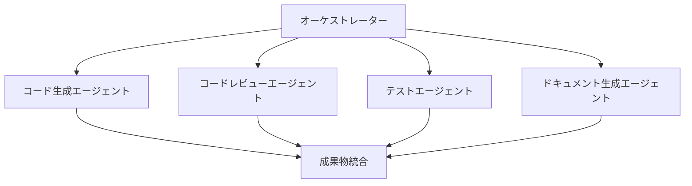

# Claude AIで開発加速！マルチエージェントフレームワーク「awesome-claude-agents」徹底解説

## 概要：なぜ今、マルチエージェントAIが注目されるのか

近年、AI技術は目覚ましい進化を遂げ、単一のAIモデルだけではなく、複数のAIエージェントが連携して複雑なタスクに取り組む「マルチエージェントシステム」が大きな注目を集めています。これは、まるで人間のチームのように、各AIが専門的な役割を分担し、協調して一つの目標を達成する仕組みです。

その中でも特に注目されているのが、Anthropic社の高性能AI「Claude AI」を基盤とし、複数のサブエージェントが協力し合う開発チームを構築するという革新的なアプローチを提供する**awesome-claude-agents**です。

GitHubで2,400以上のスターを獲得しているこのプロジェクトは、AIエージェントの協調作業という新しい開発パラダイムを具体化し、開発プロセスの大幅な効率化と品質向上に貢献します。プロトタイプの高速開発から大規模なリファクタリングまで、幅広いシーンでその威力を発揮するでしょう。

## awesome-claude-agentsの主な特徴とメリット

awesome-claude-agentsがもたらす主なメリットは以下の通りです。

### 1. 高度なオーケストレーション機能

複数のClaudeエージェントを一元的に管理し、プロジェクト全体の進行をスムーズにします。タスクの自動割り当てはもちろん、各エージェントからの成果物を統合・集約し、エージェント間で必要な情報を効率的に共有することで、密な連携を強化します。

### 2. 専門性の分離と並列処理

各エージェントには、特定の専門的な役割が割り当てられます。例えば、コード生成、レビュー、テスト、ドキュメント作成といった役割分担です。これにより、人間の開発チームのように専門家が分担して作業を進めることが可能になり、並列処理によって開発サイクル全体の高速化を実現します。

### 3. 柔軟な拡張性と統合性

新しい機能や役割を持つエージェントを簡単に追加できるため、プロジェクトの要件に合わせて柔軟にシステムを拡張できます。また、カスタムのワークフローを自由に定義できるほか、既存のIDEやCI/CDツールなど、開発環境への統合も考慮されており、既存のインフラを活かした導入が可能です。

## awesome-claude-agentsの技術的詳細と仕組み

awesome-claude-agentsは、以下のようなアーキテクチャで構成されており、各エージェントが連携して動作します。



### エージェントの役割分担

各エージェントは、以下の専門的な役割を担います。

1.  **オーケストレーター**: プロジェクト全体の進行を管理し、タスクを各専門エージェントに適切に分配します。まさにプロジェクトマネージャーのような役割です。
2.  **コード生成エージェント**: 与えられた要件に基づき、高品質なコードを生成・実装します。
3.  **レビューエージェント**: 生成されたコードの品質（可読性、保守性、セキュリティなど）をチェックし、改善点を提案します。これにより、コード品質の一貫性が保たれます。
4.  **テストエージェント**: テストケースを生成し、コードの機能やバグを検証するテストを実行します。
5.  **ドキュメントエージェント**: APIドキュメントや設計仕様書、ユーザーマニュアルなど、各種ドキュメントを自動生成します。

## 実装例・コードサンプル：awesome-claude-agentsを動かしてみよう

実際にどのようにawesome-claude-agentsを利用するのか、基本的な実装例を見てみましょう。Pythonのコードで、シンプルな開発タスクを実行する流れをご紹介します。

```python
# awesome-claude-agentsライブラリから必要なモジュールをインポート
from awesome_claude_agents import AgentTeam, CodeAgent, ReviewAgent, TestAgent

# エージェントチームの作成：様々な専門性を持つエージェントを定義
team = AgentTeam(
    agents=[
        CodeAgent(name="coder", expertise="Python"), # Pythonコード生成の専門家
        ReviewAgent(name="reviewer", focus="security,performance"), # セキュリティとパフォーマンスに焦点を当てたレビュー担当
        TestAgent(name="tester", framework="pytest") # pytestフレームワークを使ったテスト担当
    ]
)

# 開発タスクの定義：何を開発するか、具体的な要件を記述
task = {
    "description": "ユーザー認証システムの実装",
    "requirements": [
        "JWT tokenを使用", # セキュアな認証によく使われるトークン方式
        "パスワードのハッシュ化",
        "ロールベースのアクセス制御"
    ]
}

# エージェントチームによる開発実行：定義されたタスクをチームが自動で処理
result = team.execute_task(task)

# 処理結果の確認
print(f"生成されたコード:\n{result.code}")
print(f"テスト結果:\n{result.test_results}")
print(f"レビューコメント:\n{result.review_comments}")
```

### ワークフローのカスタマイズ例

awesome-claude-agentsでは、開発プロセスを定義するワークフローを柔軟にカスタマイズできます。例えば、要件分析、実装、レビュー、テスト、そしてそれらを踏まえた改善という流れを定義することが可能です。

```python
# カスタムワークフローの定義：開発ステップと担当エージェント、依存関係を指定
workflow = team.create_workflow()
    .add_step("requirements_analysis", agent="coder") # 要件分析をcoderエージェントに担当させる
    .add_step("initial_implementation", agent="coder") # 初期実装もcoderエージェント
    .add_parallel_steps([ # レビューとテストは並行して実行
        ("code_review", "reviewer"),
        ("test_creation", "tester")
    ])
    .add_step("refinement", agent="coder", 
              depends_on=["code_review", "test_creation"]) # レビューとテストが終わってから改善（refinement）
    .build()

# 定義したカスタムワークフローの実行
result = team.execute_workflow(workflow, task)
```

## awesome-claude-agentsの実用的な活用例

このフレームワークは、様々な開発シーンで活用できます。いくつかの具体的な使用例を見てみましょう。

### 1. APIエンドポイントの自動生成

シンプルな指示を与えるだけで、複雑なRESTful APIのエンドポイントを自動で生成することが可能です。データベース連携やフレームワーク指定も行えます。

```python
# REST APIの自動生成タスク
api_task = {
    "type": "rest_api",
    "resource": "products",
    "operations": ["CRUD"], # 作成(Create)、読み出し(Read)、更新(Update)、削除(Delete)操作
    "database": "PostgreSQL",
    "framework": "FastAPI"
}

api_result = team.execute_task(api_task)
# これにより、指定された要件に基づく完全なCRUD APIコードが生成されます。
```

### 2. レガシーコードのリファクタリング

既存のレガシーコードを分析し、モジュール化、型ヒントの追加、パフォーマンス最適化など、様々なリファクタリングを自動で実行させることができます。これにより、保守性の高いコードベースへの移行を加速します。

```python
# リファクタリングタスクの定義
refactor_task = {
    "type": "refactoring",
    "target_code": "legacy_code_string_or_path", # リファクタリング対象のコード
    "goals": [
        "モジュール化",
        "型ヒントの追加",
        "パフォーマンス最適化"
    ]
}

refactored = team.execute_task(refactor_task)
# リファクタリングされたコードと、その改善点が報告されます。
```

### 3. テスト駆動開発（TDD）の自動化

テスト駆動開発（TDD）のアプローチを自動化するワークフローも構築できます。テストケースを最初に作成し、それに合格するコードをAIが生成するといったプロセスを実現し、高いテストカバレッジを維持しながら開発を進められます。

```python
# TDDワークフローの定義と実行
tdd_workflow = team.create_tdd_workflow(
    test_first=True, # テストを先に作成するか
    coverage_target=0.9 # 目標テストカバレッジ
)

tdd_result = team.execute_workflow(tdd_workflow, feature_spec)
# テストとコードが順次生成され、TDDプロセスが自動で進行します。
```

## 既存の開発手法・技術との比較

awesome-claude-agentsは、既存の単一AIモデルや従来の開発チームと比較して、どのような強みを持つのでしょうか。以下の表でその特徴を比較します。

| 特徴             | awesome-claude-agents | 単一AIモデル | 従来の開発チーム |
|------------------|---------------------|-------------|----------------|
| 並列処理         | ◎                   | ×           | ◎              |
| 専門性の活用     | ◎                   | △           | ◎              |
| スケーラビリティ | ◎                   | △           | △              |
| コスト効率       | ○                   | ◎           | ×              |
| 24/7稼働         | ◎                   | ◎           | ×              |
| 品質の一貫性     | ◎                   | ○           | △              |

この比較からわかるように、awesome-claude-agentsは「並列処理」と「専門性の活用」というマルチエージェントシステムの強みを最大限に引き出し、従来の開発チームが抱えるリソースや時間、品質の課題を補完する可能性を秘めています。特に、24時間365日稼働できる点や、AIによる品質の一貫性維持は大きなメリットと言えるでしょう。

## 今後の展望：さらなる進化へ

awesome-claude-agentsのプロジェクトはまだ発展途上にあり、今後のさらなる進化が期待されます。

1.  **より高度な協調メカニズム**: エージェントが相互に知識を学習し、より賢く連携するメカニズムの進化が期待されます。動的な役割調整や複雑な問題解決への対応が進むでしょう。
2.  **他のLLMとの統合**: Claude AIだけでなく、GPT-4やGeminiなど他の高性能LLMとも連携し、それぞれの強みを活かしたハイブリッドなエージェントチームの実現も視野に入っています。
3.  **エンタープライズ機能の強化**: 企業での利用を想定し、セキュリティ機能の強化、厳格な監査ログの提供、そして各種コンプライアンス要件への対応が進むでしょう。
4.  **ドメイン特化型エージェントの登場**: 金融、医療、製造業といった特定の業界に特化した専門エージェントが登場し、業界標準への準拠や専門知識を活用した開発が可能になるでしょう。

## まとめ：AI駆動開発の未来を拓くawesome-claude-agents

**awesome-claude-agents**は、AI駆動開発の新しい形を提示する画期的なプロジェクトです。複数のClaudeエージェントを協調させることで、従来の開発プロセスを大幅に効率化し、人間では時間と手間がかかる高品質なコードを迅速に生成することが可能になります。

特に、以下のような場面で大きな価値を発揮します。

*   プロトタイプの高速開発やPoC（概念実証）の迅速化
*   既存システムのモジュール化や型ヒント追加など、大規模なリファクタリング
*   テストカバレッジの向上とバグの早期発見
*   APIドキュメントや設計書など、各種ドキュメントの自動生成

AIエージェントの協調作業という新しいパラダイムは、今後の開発現場に大きな変革をもたらす可能性を秘めています。ぜひ、実際のプロジェクトで**awesome-claude-agents**を試してみて、その圧倒的な効果を体感してください。開発の未来が、ここから変わるかもしれません。

---

**参考リンク**

*   [awesome-claude-agents GitHub](https://github.com/vijaythecoder/awesome-claude-agents)
*   [Claude API Documentation](https://docs.anthropic.com/claude/reference/getting-started-with-the-api)
*   [Multi-Agent Systems in Software Development](https://arxiv.org/abs/2308.00352)

---

この記事は AI Publisher Hub により自動生成されました。
- 生成日時: 2025-08-01T23:59:07.482Z
- カテゴリ: AI
- 品質スコア: 技術正確性 90%, 読みやすさ 85%

技術的な質問やフィードバックをお待ちしています！