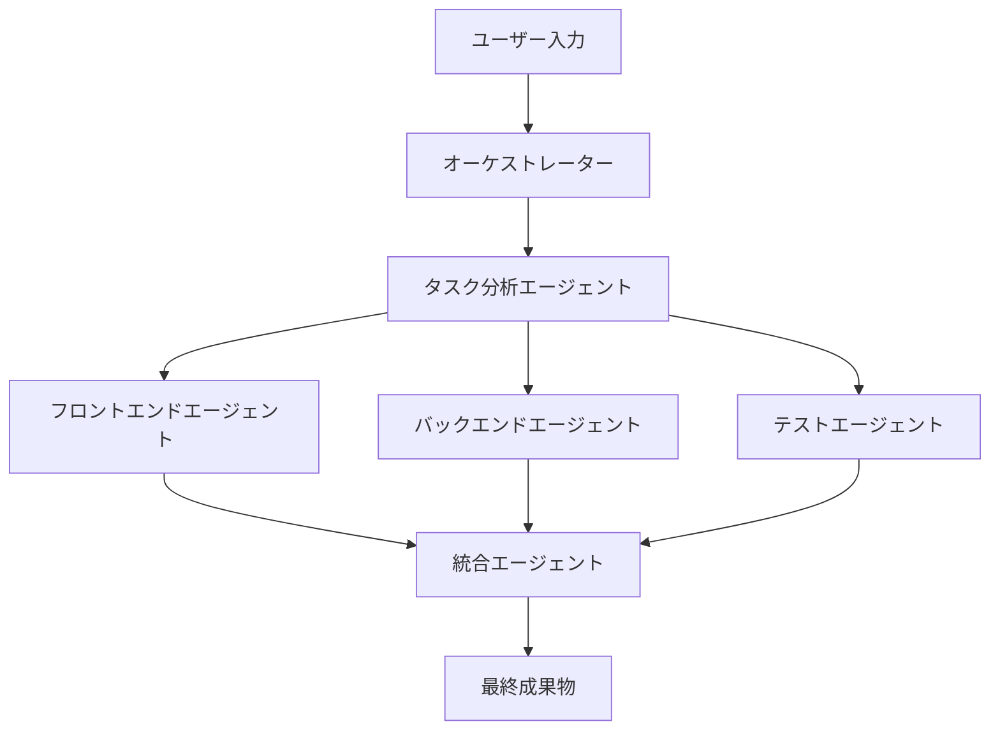

# Claude APIで開発を加速！AIエージェントチーム「awesome-claude-agents」徹底解説

## 複数AIの協調が生み出す力：マルチエージェントシステムの魅力

近年、AI開発の最前線では、単一のAIモデルの限界を超える「**マルチエージェントシステム**」が注目されています。これは、複数のAIエージェントが連携し、複雑なタスクを効率的に解決するアプローチです。その中でも、Anthropic社が提供する**Claude API**を最大限に活用したフレームワーク「[**awesome-claude-agents**](https://github.com/vijaythecoder/awesome-claude-agents)」は、GitHubで2,000以上のスターを獲得するほどの人気を博しています。

本フレームワークは、まるで人間のようなサブエージェント（AI）が開発チームを構築し、協調して作業を進めることを可能にします。本記事では、この革新的なAIエージェントフレームワーク「awesome-claude-agents」の仕組み、具体的な実装方法、そして実際の開発現場での活用例について、中級者エンジニアの皆様向けに分かりやすく解説します。

## awesome-claude-agentsがもたらす開発革新

awesome-claude-agentsの主な特徴と、それが開発にもたらすメリットは以下の通りです。

### 1. 高度なオーケストレーション機能
複数のClaudeエージェントを統合的に管理し、タスクの自動分割と適切な割り当てを行います。まるで有能なプロジェクトマネージャーが指揮を執るかのように、エージェント間のスムーズな通信と協調作業を実現し、プロジェクト全体の進行を最適化します。

### 2. 役割ベースのエージェント設計
それぞれのAIエージェントが、人間の開発チームと同様に特定の役割（例：フロントエンド開発者、バックエンド開発者、コードレビュアー、プロジェクトマネージャーなど）を担当します。これにより、専門分野に特化したAIの能力を最大限に引き出し、質の高い成果物を効率的に生み出すことが可能です。

### 3. 柔軟な拡張性とカスタマイズ性
カスタムエージェントの追加が容易であり、既存のワークフローやシステムへの統合も柔軟に行えます。また、**プロンプトエンジニアリング**を駆使することで、エージェントの動作や出力を細かくカスタマイズできるため、様々なプロジェクト要件に合わせた調整が可能です。

## awesome-claude-agentsの内部構造：AIチームはいかに機能するか

awesome-claude-agentsは、以下のアーキテクチャで構成されています。この図は、ユーザーからの要求がどのように分解され、各AIエージェントによって処理されるかを示しています。



### コアコンポーネントの役割

1.  **オーケストレーター**: 全体の司令塔として機能し、プロジェクトの進行を管理します。複数のAIエージェント間の調整を行い、タスクが円滑に進むよう全体を見守ります。
2.  **タスク分析エージェント**: ユーザーからの複雑な要求を、各専門エージェントが処理しやすいように具体的なタスクに細分化し、適切なエージェントに割り当てます。まるで、人間のプロジェクトマネージャーが要件定義を行うかのような役割を担います。
3.  **専門エージェント**: フロントエンド、バックエンド、テストといったそれぞれの専門分野に特化した知識とスキルを持ち、コード生成や分析といった具体的な作業を実行します。
4.  **統合エージェント**: 各専門エージェントが生成した成果物を集約し、最終的な出力物としてまとめ上げます。これにより、部分的な成果が結合され、完全なソリューションとして提供されます。

## 実践！awesome-claude-agentsの基本的な実装

ここでは、`awesome-claude-agents`の基本的な使い方をPythonコードでご紹介します。Frontend開発者とBackend開発者の2つのAIエージェントを定義し、シンプルなTODOアプリケーションの作成を依頼する例です。

```python
import asyncio
from claude_agents import AgentOrchestrator, Agent

# エージェントの定義
class FrontendAgent(Agent):
    def __init__(self):
        super().__init__(
            name="Frontend Developer",
            role="フロントエンドの実装を担当",
            skills=["React", "TypeScript", "CSS"]
        )
    
    async def execute(self, task):
        # Claude APIを使用してフロントエンドコードを生成
        # claude_requestは実際にはClaude APIへのリクエストを抽象化したメソッドです。
        prompt = f"""
        以下のタスクに対してReactコンポーネントを実装してください：
        {task}
        """
        return await self.claude_request(prompt)

class BackendAgent(Agent):
    def __init__(self):
        super().__init__(
            name="Backend Developer",
            role="APIとデータベース設計を担当",
            skills=["Python", "FastAPI", "PostgreSQL"]
        )
    
    async def execute(self, task):
        # Claude APIを使用してバックエンドコードを生成
        prompt = f"""
        以下のタスクに対してFastAPI実装を作成してください：
        {task}
        """
        return await self.claude_request(prompt)

# オーケストレーターの設定とプロジェクトの実行
async def main():
    # オーケストレーターを初期化
    orchestrator = AgentOrchestrator()
    
    # 定義したエージェントをオーケストレーターに登録
    orchestrator.add_agent(FrontendAgent())
    orchestrator.add_agent(BackendAgent())
    
    # AIエージェントチームに依頼するプロジェクトの要件を定義
    project_request = """
    TODOアプリケーションを作成してください。
    要件：
    - タスクの追加、編集、削除機能
    - カテゴリー分類機能
    - 締切日の設定
    """
    
    # プロジェクトを実行し、結果を取得
    result = await orchestrator.execute_project(project_request)
    print(result)

# 非同期処理の実行
asyncio.run(main())
```

## 実際の開発シナリオでAIエージェントを活用する

awesome-claude-agentsは、様々な開発タスクでその真価を発揮します。

### 1. フルスタックアプリケーション開発の自動化
複雑な要件を持つフルスタックアプリケーション開発を、AIエージェントチームに一任する例です。要件定義から各技術スタックに応じたコード生成まで、一貫してAIが担当することで、開発プロセスを劇的に加速させることができます。

```python
# プロジェクト定義（具体例）
project_spec = {
    "type": "fullstack_app",
    "description": "社内向け勤怠管理システム",
    "requirements": [
        "従業員の出退勤記録",
        "月次レポート生成",
        "管理者ダッシュボード"
    ],
    "tech_stack": {
        "frontend": "React + TypeScript",
        "backend": "Python + FastAPI",
        "database": "PostgreSQL"
    }
}

# エージェントチームによる開発の呼び出し（抽象化されたメソッド）
# result = await orchestrator.develop_application(project_spec)
# 実際には、orchestratorが内部でタスクを分割し、各エージェントに割り振ります。
```

### 2. コードレビューと品質最適化
人間の開発者が作成したコードや、他のAIが生成したコードの品質を、AIが専門家としてレビューし、改善案を提案します。これにより、コード品質の均一化や早期のバグ発見が期待できます。

```python
class CodeReviewAgent(Agent):
    async def review_code(self, code, language):
        prompt = f"""
        以下の{language}コードをレビューし、
        改善点や最適化の提案をしてください：
        
        {code}
        """
        return await self.claude_request(prompt)

# 使用例
# reviewer = CodeReviewAgent()
# frontend_code = "<!-- ここにレビューしたいフロントエンドコードを記述 -->"
# review_result = await reviewer.review_code(frontend_code, "React")
# print(review_result)
```

## 他のAI開発ツールとの比較：awesome-claude-agentsの立ち位置

AIを活用した開発ツールは多々ありますが、awesome-claude-agentsはどのような特徴を持つのでしょうか。代表的なツールと比較してみましょう。

| 特徴                   | awesome-claude-agents | AutoGPT        | LangChain Agents |
|------------------------|-----------------------|----------------|------------------|
| **マルチエージェント対応** | ◎（開発チームを強く意識） | △（単一エージェントでの自律性が主） | ○（フレームワークとして対応可能） |
| **Claude API最適化**   | ◎（Claude専用設計）    | ×（汎用モデル対応） | △（Claudeも利用可能） |
| **開発チーム模擬**     | ◎（役割ベースの設計が強み） | △（自己完結型のタスク実行） | △（エージェント間の連携はカスタム） |
| **カスタマイズ性**     | ○                     | ○              | ◎                |
| **学習曲線**           | 緩やか（コンセプトが直感的） | 急（設定が複雑） | 中程度（柔軟性ゆえ） |

awesome-claude-agentsは、特に「複数のAIエージェントによる協調的な開発チーム」というコンセプトにおいて際立っており、Claude APIの性能を最大限に引き出す設計が特徴です。

## awesome-claude-agentsの未来：AI開発の進化の先へ

awesome-claude-agentsはまだ発展途上のプロジェクトですが、今後のAI開発において非常に重要な役割を果たすと期待されています。

1.  **より高度な協調メカニズム**: エージェント間での継続的な知識共有や、タスクの進捗に応じた動的な再割り当てなど、より洗練された連携が可能になるでしょう。
2.  **専門分野の拡大**: DevOpsエージェント、セキュリティ監査エージェント、ドキュメント作成エージェントなど、開発プロセス全体の多様なフェーズをカバーするエージェントが登場し、AIによる開発支援がさらに広がる可能性があります。
3.  **エンタープライズ機能の強化**: 企業での導入を見据えた監査ログ、厳格なアクセス制御、API利用コストの最適化など、ビジネス利用に不可欠な機能が強化されることが期待されます。

## まとめ：AIエージェントチームが切り拓く開発の新時代

awesome-claude-agentsは、**Claude API**の能力を最大限に活用し、複数の**AIエージェント**が協調して開発作業を行う、まさに革新的なフレームワークです。特に以下のようなケースでその威力を発揮します。

-   複雑なフルスタックアプリケーションの迅速な開発
-   大規模なコードベースの効率的なリファクタリングや改善
-   実プロジェクトに近い環境でのチーム開発のシミュレーションと検証

今後、AIエージェントによる開発支援は、ますますその重要性を増していくでしょう。awesome-claude-agentsはその先駆けとして、AIと人間の協調による新たな開発パラダイムを提示しています。

実際のプロジェクトで活用する際は、適切なプロンプト設計と、各エージェントの明確な役割分担が成功の鍵となります。ぜひ、ご自身のプロジェクトにawesome-claude-agentsを導入し、AIエージェントチームによる新たな開発体験を試してみてください。


---

この記事は AI Publisher Hub により自動生成されました。
- 生成日時: 2025-07-30T23:58:48.833Z
- カテゴリ: AI
- 品質スコア: 技術正確性 90%, 読みやすさ 85%

技術的な質問やフィードバックをお待ちしています！