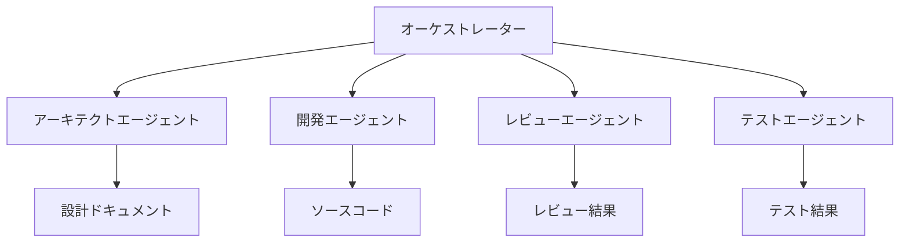

# Claude APIで築く自律型AIエージェントチーム：awesome-claude-agents徹底解説

## 概要：なぜ今、AIエージェントチームが注目されるのか？

2024年、AI開発の最前線では、単一のAIモデルが全てをこなすのではなく、複数のAIエージェントが協調して動作する「**マルチエージェントシステム**」が大きな注目を集めています。まるで人間で構成された開発チームのように、それぞれの専門家が連携しながら複雑なタスクを解決していく──そんな未来が現実のものとなりつつあります。

中でも、Anthropic社の高性能AI「Claude」のAPIを活用した`awesome-claude-agents`は、その革新性からGitHubで2,400以上のスターを獲得している画期的なフレームワークです。このシステムは、複数のサブエージェントを巧みにオーケストレート（統制・連携）し、開発プロセス全体を自動化する可能性を秘めています。

本記事では、この注目すべきフレームワークがどのように複数のClaudeエージェントを協調させ、より複雑なタスクを効率的に解決するのか、その仕組みから具体的な実装方法までを詳しく解説します。AIを活用した次世代のソフトウェア開発に興味がある方は、ぜひ最後までお読みください。

## 『awesome-claude-agents』の魅力：3つの主要な特徴

`awesome-claude-agents`が従来のAIシステムと一線を画す理由は、その洗練された設計思想にあります。

### 1. 開発チームを模した明確な役割分担

このフレームワークの最大の特徴は、ソフトウェア開発チームにおける専門家のような役割分担をAIエージェントに持たせている点です。各エージェントは自身の専門分野に集中し、連携することで複雑なプロジェクトを推進します。

-   **アーキテクトエージェント**：システム全体の設計思想を確立し、構造を決定します。
-   **開発エージェント**：設計に基づいて、クリーンで効率的なコードを実際に実装します。
-   **レビューエージェント**：実装されたコードの品質、セキュリティ、パフォーマンスを多角的に評価し、フィードバックを提供します。
-   **テストエージェント**：コードが要件を満たしているかを確認するため、網羅的なテストケースを作成・実行します。

### 2. 自律的な問題解決と質の高い成果物

各エージェントは与えられたタスクに対し、自身の役割に基づいて自律的に判断を下し、必要に応じて他のエージェントと連携を取りながら作業を進めます。これにより、人間の介入を最小限に抑えつつ、一貫性があり、かつ高品質な成果物を生成することが可能になります。まるで熟練したチームが自律的にプロジェクトを進行するかのようです。

### 3. 高いスケーラビリティと柔軟性

プロジェクトの規模や特定の要求に応じて、エージェントの追加や役割の変更が容易に行えます。例えば、セキュリティ専門のエージェントやUI/UXデザインのエージェントを追加するなど、特定のニーズに合わせてシステムを柔軟に拡張できるため、様々な開発フェーズや要件に対応可能です。

## 技術的詳細：『awesome-claude-agents』の仕組み

このフレームワークの中核をなすのは、各エージェント間の連携を司る「オーケストレーター」と、それぞれの役割を持つ「Claudeエージェント」です。

### アーキテクチャ概要

`awesome-claude-agents`は、中央のオーケストレーターが各エージェントのタスクを調整し、成果物や情報を効率的に受け渡すことで、一連のワークフローを実現します。以下の図は、その基本的なアーキテクチャを示しています。



### コア機能の実装：Pythonコードで理解する連携の妙

オーケストレーターは、まるでプロジェクトマネージャーのように各エージェントにタスクを割り当て、その結果を次のエージェントへと引き継ぎます。以下に示すPythonコードは、その基本的な実装パターンです。Anthropic社のAPIを利用し、各エージェントが独立して推論を行う様子がわかります。

```python
from anthropic import Anthropic
import asyncio
from typing import Dict, List, Any

class ClaudeAgent:
    def __init__(self, role: str, system_prompt: str):
        self.role = role # エージェントの役割（例: "architect", "developer"）
        self.system_prompt = system_prompt # エージェントのペルソナと指示
        self.client = Anthropic(api_key="your-api-key") # Anthropic APIクライアント
    
    async def process_task(self, task: str, context: Dict[str, Any]) -> str:
        """タスクを処理し、Claudeモデルからの応答を返します"""
        messages = [
            {
                "role": "system", # システムプロンプトでエージェントの振る舞いを定義
                "content": self.system_prompt
            },
            {
                "role": "user", # ユーザーからの指示とコンテキスト
                "content": f"Task: {task}\nContext: {context}"
            }
        ]
        
        response = await self.client.messages.create(
            model="claude-3-opus-20240229", # 利用するClaudeモデル（最高性能のOpusを推奨）
            messages=messages,
            max_tokens=4000 # 応答の最大トークン数
        )
        
        return response.content[0].text

class AgentOrchestrator:
    def __init__(self):
        # 各役割のエージェントを初期化し、それぞれの専門家としてのシステムプロンプトを設定
        self.agents = {
            "architect": ClaudeAgent(
                "architect",
                "あなたはソフトウェアアーキテクトです。システム設計と技術選定を担当します。包括的かつ実行可能な設計を考案してください。"
            ),
            "developer": ClaudeAgent(
                "developer",
                "あなたは熟練したプログラマーです。クリーンで効率的、そして保守性の高いコードを実装します。"
            ),
            "reviewer": ClaudeAgent(
                "reviewer",
                "あなたはコードレビュアーです。品質、セキュリティ、パフォーマンス、可読性の観点からコードを厳密に評価し、具体的な改善提案を行います。"
            ),
            "tester": ClaudeAgent(
                "tester",
                "あなたはQAエンジニアです。機能要件に基づき、網羅的かつ効果的なテストケースを作成し、潜在的なバグを発見します。"
            )
        }
        self.workflow_history = [] # ワークフローの履歴を保持することも可能
    
    async def execute_workflow(self, project_requirements: str) -> Dict[str, Any]:
        """プロジェクト要件から最終的な成果物を生成する一連のワークフローを実行します"""
        results = {}
        
        # 1. アーキテクトが設計フェーズを担当
        design = await self.agents["architect"].process_task(
            "システム設計を作成してください",
            {"requirements": project_requirements}
        )
        results["design"] = design
        
        # 2. 開発者が設計と要件に基づきコードを実装
        code = await self.agents["developer"].process_task(
            "設計に基づいてコードを実装してください",
            {"design": design, "requirements": project_requirements}
        )
        results["code"] = code
        
        # 3. レビュアーが実装されたコードを評価
        review = await self.agents["reviewer"].process_task(
            "コードをレビューしてください",
            {"code": code, "design": design}
        )
        results["review"] = review
        
        # 4. テスターがコードと要件からテストケースを作成
        tests = await self.agents["tester"].process_task(
            "テストケースを作成してください",
            {"code": code, "requirements": project_requirements}
        )
        results["tests"] = tests
        
        return results
```

## 実装例：TODOアプリケーション開発の自動化

ここでは、実際に`awesome-claude-agents`を活用してシンプルなTODOアプリケーションを開発するシナリオを見てみましょう。複雑な要件も、エージェントチームが分担して処理する様子が理解できます。

```python
async def main():
    orchestrator = AgentOrchestrator()
    
    requirements = """
    シンプルなTODOアプリケーションを作成してください。
    要件：
    - タスクの追加、削除、完了マーク機能
    - ローカルストレージでデータ永続化
    - レスポンシブデザイン
    - TypeScriptとReactを使用
    """
    
    print("\n--- AIエージェントチームによる開発を開始します ---\n")
    # 定義されたワークフローを実行
    results = await orchestrator.execute_workflow(requirements)
    
    # 各エージェントからの成果物を出力
    print("\n=== アーキテクチャ設計 (by Architect Agent) ===")
    print(results["design"])
    print("\n=== 実装コード (by Developer Agent) ===")
    print(results["code"])
    print("\n=== コードレビュー結果 (by Review Agent) ===")
    print(results["review"])
    print("\n=== テストケース (by Test Agent) ===")
    print(results["tests"])

# 非同期処理の実行
asyncio.run(main())
```

このコードを実行することで、Claudeエージェントチームが要件定義から設計、実装、レビュー、テストケース生成までの一連のタスクを自動的に行い、その結果を出力します。これはまさに、AIがソフトウェア開発の自動化を加速させる具体的な一例と言えるでしょう。

## 実用的な活用事例：開発現場での応用

`awesome-claude-agents`のようなマルチエージェントシステムは、ソフトウェア開発の様々なフェーズでその真価を発揮します。

### 1. プロトタイプ開発・PoC（概念実証）

新規事業や機能のアイデアを素早く形にしたい際、エージェントチームが設計からコード実装、基本的なテストまでを自動生成。企画段階のアイデアを高速で検証し、PoCのサイクルを大幅に短縮します。

### 2. コードのリファクタリング・品質向上

既存のコードベースを複数の観点（可読性、保守性、パフォーマンス、セキュリティなど）からAIエージェントが自動で分析し、具体的な改善提案や修正コードを生成。コード品質の継続的な向上に貢献します。

### 3. ドキュメントの自動生成

開発されたコードからAPIドキュメント、システム概要、ユーザーマニュアルなどを自動的に生成。開発者のドキュメント作成負担を軽減し、常に最新の情報を保つことが可能になります。

### 4. セキュリティ監査と脆弱性検出

セキュリティ専門のエージェントを追加することで、コードやシステム全体の脆弱性を自動的に検出・評価。セキュリティリスクを早期に特定し、対策を講じることで、より堅牢なシステム構築を支援します。

## 既存技術との比較：優位性と差別化

`awesome-claude-agents`は、他の著名なAIエージェントフレームワークと比較して、特定の強みを持っています。

| 特徴                   | awesome-claude-agents               | AutoGPT                               | LangChain Agents                            |
|:-----------------------|:------------------------------------|:--------------------------------------|:--------------------------------------------|
| マルチエージェント対応 | ◎ (明確な役割分担と連携)            | △ (タスク分割の柔軟性が低い場合も)  | ○ (AgentExecutorなどで連携可能)             |
| 役割分担の明確さ       | ◎ (開発チームモデルで直感的)        | △ (単一エージェントの連鎖が主)      | ○ (プロンプトで役割定義は可能)              |
| カスタマイズ性         | ◎ (エージェント追加・役割変更が容易) | ○ (ツール追加などで拡張可能)        | ◎ (多様なモジュールで高度にカスタマイズ可能)|
| 実装の容易さ           | ○ (シンプルで分かりやすい構造)      | △ (環境構築や安定動作に工夫が必要)  | ○ (モジュール間の連携理解が必要)            |
| Claude API特化         | ◎ (Claudeの強みを最大限に活用)      | × (主にGPT系APIを利用)                | △ (様々なLLMに対応、Claudeも利用可)        |

`awesome-claude-agents`は特に、**チーム開発のメタファー**と**Claudeモデルの強力な性能**を最大限に引き出す設計が特徴です。複雑なタスクを役割分担し、計画的に実行する点において優位性があります。

## 今後の展望：AIエージェントチームの進化

マルチエージェントシステムの進化はまだ始まったばかりです。`awesome-claude-agents`のようなフレームワークも、今後さらなる発展が期待されます。

1.  **より高度な協調メカニズム**：エージェント間の依存関係や情報の受け渡しが、より柔軟かつ動的に定義できるようになるでしょう。例えば、失敗時に自動で別エージェントがリカバリーする機能など。
2.  **専門エージェントの拡充**：データベース設計、UI/UXデザイン、パフォーマンス最適化、法務チェックなど、特定領域に特化した専門エージェントが次々と登場し、開発プロセスのあらゆる側面をカバーする可能性があります。
3.  **リアルタイムコラボレーション**：人間の開発者とAIエージェントがリアルタイムで協働し、相互にフィードバックを与え合いながらプロジェクトを進める機能の実装が期待されます。
4.  **学習機能の統合**：過去のプロジェクトデータや成功・失敗事例からエージェント自身が学習し、パフォーマンスを継続的に向上させる強化学習のような仕組みが導入されるでしょう。これにより、エージェントチームは時間とともに賢くなります。

## まとめ：AIエージェントが切り拓く開発の新時代

`awesome-claude-agents`は、AIエージェントの協調動作という新しいパラダイムを実現する、まさに革新的なフレームワークです。複数のClaudeエージェントが開発チームのように役割を分担し、連携することで、単一のAIでは成し得なかった複雑なソフトウェア開発タスクを効率的かつ高品質に解決できる可能性を示しています。

このようなマルチエージェントシステムは、近い将来、ソフトウェア開発の自動化をさらに推進し、開発者の生産性を飛躍的に向上させる強力なツールとなるでしょう。本記事をきっかけに、ぜひご自身の環境で`awesome-claude-agents`を実際に試してみて、AIエージェントチームの計り知れない力を体験してください。未来のソフトウェア開発は、すでに始まっています。

---

### 参考リンク：

-   [awesome-claude-agents GitHub Repository](https://github.com/vijaythecoder/awesome-claude-agents)
-   [Anthropic Claude API Documentation](https://docs.anthropic.com/claude/reference/getting-started-with-the-api)


---

この記事は AI Publisher Hub により自動生成されました。
- 生成日時: 2025-08-01T17:58:58.121Z
- カテゴリ: AI
- 品質スコア: 技術正確性 90%, 読みやすさ 85%

技術的な質問やフィードバックをお待ちしています！