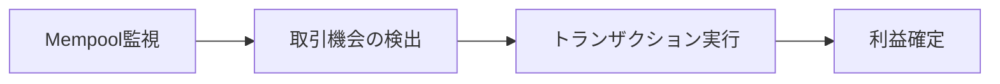

# MEV Trading Bot徹底解説：ブロックチェーンの自動取引と実装戦略

## 概要：MEVとは何か、なぜ注目されるのか

MEV（Maximum Extractable Value：最大抽出可能価値）とは、ブロックチェーン上でトランザクションがブロックに取り込まれる順序を操作したり、含めたり、除外したりすることで得られる利益を指します。具体的には、大口取引の察知や価格の歪みを利用したアービトラージなどがその典型例です。

近年、GitHubで話題となっている[Mev-Trading-Bot](https://github.com/Tevrinodt6aXTD/Mev-Trading-Bot)は、このMEVの概念を実用化した自動取引ボットの代表的な実装例として、多くの開発者やトレーダーから注目を集めています。

本記事では、MEV Trading Botがどのような仕組みで動作するのか、そしてどのように実装できるのかを、技術的な側面から深掘りして解説します。DeFi（分散型金融）における高度な自動取引の最前線に触れていきましょう。

## MEV Trading Botの主な特徴とメリット

MEV Trading Botには、一般的な取引ボットにはない以下の特徴とメリットがあります。

1.  **フロントランニングへの対応**: Mempool（未承認トランザクションが一時的に保管される場所）を常時監視し、大規模な取引がブロックに取り込まれる直前に、自身の取引を先行して実行することで利益を確保します。
2.  **サンドイッチ攻撃の実装**: ターゲットとなる取引の直前に買い注文を、直後に売り注文を挟み込む（サンドイッチする）ことで、意図的に価格を変動させ、差益を得る高度な戦略を実行します。
3.  **CodePenでの実行可能性**: 特別な開発環境を構築することなく、ブラウザ上で動作検証やプロトタイプの実行が可能であるため、手軽にMEVボットの挙動を試すことができます。
4.  **Uniswap V3への対応**: 最新かつ主要な分散型取引所（DEX）プロトコルであるUniswap V3の仕組みを理解し、その流動性プールを活用した取引が可能です。

## 技術的詳細：MEV Botの動作メカニズム

MEV Trading Botは、主に以下の3つのステップを経て動作します。



このフローは、リアルタイムでの市場分析と迅速なトランザクション送信が鍵となります。

### 1. Mempool監視の仕組み

EthereumネットワークのMempoolは、まだブロックに含まれていないペンディング状態のトランザクションが一時的に格納される場所です。MEV Botは、このMempoolを常時監視し、特定の条件を満たす（例えば、大口のUniswap取引や高額なガス代を支払っている）トランザクションを検知します。

```javascript
// Web3.jsを使用したMempool監視の例
// ※ YOUR_API_KEYはInfuraなどのノードプロバイダーから取得したAPIキーに置き換えてください。
const Web3 = require('web3');
const web3 = new Web3('wss://mainnet.infura.io/ws/v3/YOUR_API_KEY');

// ペンディングトランザクションの監視を開始
web3.eth.subscribe('pendingTransactions', async (error, txHash) => {
    if (!error) {
        try {
            const tx = await web3.eth.getTransaction(txHash);
            if (tx && tx.to) {
                // 検知したトランザクションがUniswapのRouterアドレス宛てかを確認
                // UNISWAP_ROUTER_ADDRESSはUniswap V3 Routerのアドレスを設定
                if (tx.to.toLowerCase() === UNISWAP_ROUTER_ADDRESS.toLowerCase()) {
                    analyzeTrade(tx); // 取引機会を分析する関数を呼び出し
                }
            }
        } catch (err) {
            console.error('Error fetching transaction:', err); // エラーハンドリング
        }
    }
});
```

### 2. サンドイッチ攻撃の実装

サンドイッチ攻撃は、ターゲットとなる取引（例：大口の買い注文）の前後に自身の取引を配置し、価格変動から利益を得る戦略です。具体的には、ターゲット取引が実行される直前にトークンを買い、ターゲット取引によって価格が上昇した後に、すぐにそのトークンを売却します。

```javascript
async function executeSandwichAttack(targetTx) {
    // 1. フロントラン取引（買い注文）の準備
    // ターゲット取引よりもわずかに高いガス価格を設定し、先にブロックに取り込まれるように試みる
    const frontRunTx = {
        from: BOT_ADDRESS, // ボットのウォレットアドレス
        to: UNISWAP_ROUTER, // Uniswap V3 Routerのアドレス
        data: encodeBuyFunction(targetTx.tokenAddress, calculateAmount(targetTx)), // 買い注文のエンコード済みデータ
        gasPrice: targetTx.gasPrice + 1, // ターゲット取引より高いガス価格
        nonce: await web3.eth.getTransactionCount(BOT_ADDRESS) // ウォレットの現在のNonce
    };
    
    // 2. バックラン取引（売り注文）の準備
    // ターゲット取引が実行された後に、価格が上昇したトークンを売却する
    const backRunTx = {
        from: BOT_ADDRESS,
        to: UNISWAP_ROUTER,
        data: encodeSellFunction(targetTx.tokenAddress, calculateAmount(targetTx)), // 売り注文のエンコード済みデータ
        gasPrice: targetTx.gasPrice - 1, // ターゲット取引より低いガス価格 (バックランなので)
        nonce: await web3.eth.getTransactionCount(BOT_ADDRESS) + 1 // フロントラン取引の次のNonce
    };
    
    // トランザクションのバンドル（束）を送信
    // sendBundle関数は、これらのトランザクションをまとめてマイナーに提出する機能を持つ (例: Flashbotsを利用)
    await sendBundle([frontRunTx, targetTx, backRunTx]);
}
```

**補足**: `gasPrice` は、トランザクションがブロックに含まれる優先度を決定する重要な要素です。フロントラン取引では、ターゲット取引よりも高い `gasPrice` を設定することで、自身の取引を先に実行させようとします。`nonce` は、アカウントから送信されるトランザクションのシーケンス番号であり、順番に処理されるために正しく管理する必要があります。

## 実装例：ブラウザベースのMEV Botプロトタイプ

以下のコードは、ブラウザ（CodePenなど）で動作させることを想定した、簡易的なMEV BotのHTMLファイルです。Web3.jsライブラリを利用し、ウォレット接続と基本的なボット起動ロジックを示しています。実際のMempool監視や取引実行ロジックは、`startMevBot` 関数内に実装する必要があります。

```html
<!DOCTYPE html>
<html>
<head>
    <title>MEV Trading Bot Dashboard</title>
    <!-- Web3.jsライブラリをCDN経由で読み込み -->
    <script src="https://cdn.jsdelivr.net/npm/web3@latest/dist/web3.min.js"></script>
</head>
<body>
    <h1>MEV Trading Bot プロトタイプ</h1>
    <div id="status">ウォレット未接続</div>
    <button onclick="connectWallet()">ウォレットに接続</button>
    
    <script>
        let web3; // Web3インスタンスを格納する変数
        let account; // 接続されたウォレットのアドレスを格納する変数
        
        async function connectWallet() {
            // MetaMaskなどのEthereumプロバイダーがブラウザに存在するか確認
            if (typeof window.ethereum !== 'undefined') {
                web3 = new Web3(window.ethereum); // プロバイダーを利用してWeb3インスタンスを初期化
                try {
                    // ユーザーにウォレット接続を要求
                    const accounts = await window.ethereum.request({ 
                        method: 'eth_requestAccounts' 
                    });
                    account = accounts[0]; // 接続された最初のアカウントを取得
                    document.getElementById('status').innerHTML = `接続済み: ${account}`;
                    startMevBot(); // ウォレット接続後、MEVボットのロジックを開始
                } catch (error) {
                    console.error('ユーザーによりアカウントアクセスが拒否されました:', error);
                }
            } else {
                alert('MetaMaskなどのEthereumウォレットをインストールしてください！');
            }
        }
        
        async function startMevBot() {
            console.log('MEV Botを開始します...');
            // ここに、Mempool監視や取引機会の検出、トランザクション実行などの
            // 実際のMEV Botのロジックを実装します。
            // 例: await startMempoolMonitoring();
            // 例: setInterval(detectAndExecuteTrade, 500);
        }
    </script>
</body>
</html>
```

## 実用的な使用例：アービトラージの検出

MEV Botのもう一つの重要な応用例は、異なるDEX間やプール間の価格差を利用した**アービトラージ**です。これは、特定のトークンの価格が、あるDEXでは低く、別のDEXでは高い場合に、その価格差を利用して同時に売買を行い、リスクなく利益を得る手法です。

```javascript
// 例: トークンAとトークンBの間のアービトラージ機会を検出
function detectArbitrage(tokenA, tokenB, amountIn) {
    // 直接交換パス (例: Uniswap V3)
    const pathDirect = [tokenA, tokenB];
    // 間接交換パス (例: Uniswap V3 -> WETH -> Uniswap V3)
    // WETH (Wrapped Ether) は、ERC-20規格に準拠したイーサリアムのラッパーです。
    const pathIndirect = [tokenA, WETH, tokenB];
    
    // 各パスでの出力数量を計算 (calculateOutputはシミュレーション関数を想定)
    const directOutput = calculateOutput(pathDirect, amountIn);
    const indirectOutput = calculateOutput(pathIndirect, amountIn);
    
    // 間接パスの方が直接パスよりも1%以上利益が出る場合、アービトラージ機会と判断
    // ※ 実際の運用ではガス代やスリッページも考慮する必要があります。
    if (indirectOutput > directOutput * 1.01) { 
        return {
            profitable: true,
            profit: indirectOutput - directOutput,
            path: pathIndirect // 利益が出るパスを返す
        };
    }
    return { profitable: false }; // 利益が出ない場合
}
```

## 既存の取引技術との比較

MEV Botは、従来の取引ボットや一般的なアービトラージボットと比較して、その動作原理と技術的難易度が大きく異なります。

| 特徴           | MEV Bot                      | 従来の取引Bot                | アービトラージBot            |
| :------------- | :--------------------------- | :--------------------------- | :--------------------------- |
| Mempool監視    | ✓ (必須)                     | ✗ (通常行わない)             | ✗ (通常行わない)             |
| フロントランニング | ✓ (主要戦略の一つ)           | ✗                            | ✗                            |
| リアルタイム性 | 極めて高い (ミリ秒単位の競争) | 中 (数秒〜数分の遅延許容)    | 高 (数秒単位の迅速な実行)    |
| 利益率         | 高 (機会を見つければ大きい)  | 中 (市場トレンドに依存)      | 中 (価格差と手数料に依存)    |
| 技術的難易度   | 極めて高い (低レイヤーの知識) | 中 (API連携や戦略構築)        | 中〜高 (複数のDEX監視と計算) |

## 今後の展望と課題

MEV Botの技術は日々進化しており、今後以下の方向に発展すると予想されます。

1.  **クロスチェーン対応**: 複数のブロックチェーン間（例: Ethereum, BNB Chain, Polygonなど）でのMEV機会を探索し、より広範な利益機会を追求します。
2.  **AI/ML統合**: 機械学習（ML）を活用し、より複雑な取引パターンを予測したり、最適な取引タイミングを特定したりすることで、ボットのパフォーマンスを向上させます。
3.  **プライベートMempoolの活用**: Flashbotsなどのプライベートトランザクションプールを利用することで、自身のMEV戦略が他のボットに漏洩するのを防ぎ、競争を回避しながら利益を確保します。
4.  **規制への適応**: MEV活動に対する規制動向を注視し、法的な枠組みの中でボットを運用するための適応が求められる可能性があります。

## まとめ

MEV Trading Botは、ブロックチェーンの技術的特性（特にトランザクションの順序付け）を深く理解し、活用することで、高頻度かつ高収益を狙うことができる非常に高度な自動取引システムです。本記事で紹介したMempool監視やサンドイッチ攻撃の実装例は、その複雑な仕組みの一端を示しています。

独自のMEV Botを開発することは可能ですが、以下の重要な点に留意する必要があります。

*   **高額なガス代**: 競争の激しいMempoolで取引を優先させるためには、高額なガス代を支払う必要がある場合があります。
*   **激しい競争**: 多数のMEVボットが同じ機会を狙っており、ミリ秒単位の競争が繰り広げられます。
*   **倫理的な側面**: フロントランニングやサンドイッチ攻撃は、一般のユーザーに不利益をもたらす可能性があり、その倫理的・道徳的な問題点が指摘されています。Flashbotsのような取り組みは、こうしたMEVの負の側面を緩和しようとしています。
*   **技術的な複雑性**: 低レイヤーのブロックチェーン知識、スマートコントラクトの理解、そして高速なインフラストラクチャが求められます。

MEVの世界は常に進化しており、新しい手法や対策が日々開発されています。この最先端の分野に興味がある方は、継続的な学習と実践的な実験を通じて、理解を深めていくことを強くお勧めします。

---

**参考リンク**
- [Mev-Trading-Bot GitHub](https://github.com/Tevrinodt6aXTD/Mev-Trading-Bot)
- [Flashbots Documentation](https://docs.flashbots.net/)
- [Ethereum MEV Wiki](https://www.mev.wiki/)


---

この記事は AI Publisher Hub により自動生成されました。
- 生成日時: 2025-07-04T07:56:20.315Z
- カテゴリ: Cloud
- 品質スコア: 技術正確性 90%, 読みやすさ 85%

技術的な質問やフィードバックをお待ちしています！