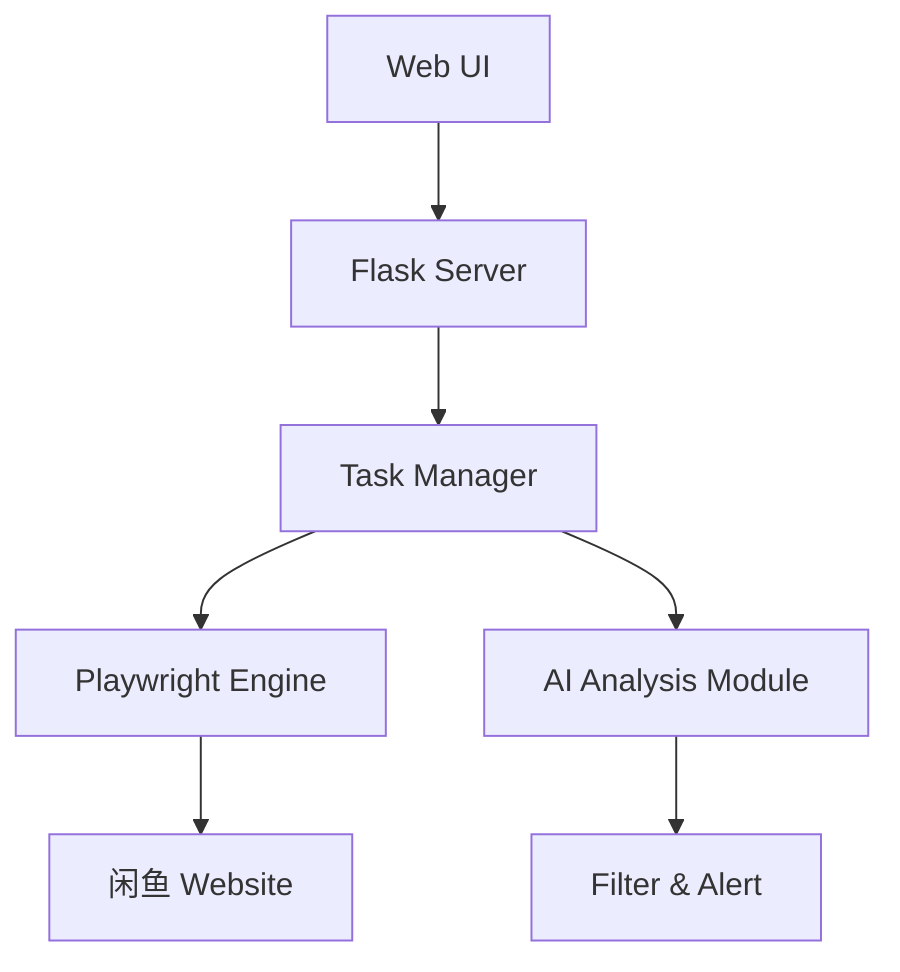

# Playwright×AIでEC監視を革新！中国ECサイト監視ツール「ai-goofish-monitor」を徹底解説

## はじめに

今日のEC市場では、商品の価格変動や在庫状況、新着出品などをリアルタイムで把握することが、ビジネス戦略上極めて重要です。特に中国の大手C2Cマーケットプレイス「闲鱼（Xianyu）」のような大規模なプラットフォームでは、手動での監視は現実的ではありません。

そこで今回ご紹介するのが、AIを搭載し、リアルタイムでのインテリジェントな監視を可能にする画期的なツール「ai-goofish-monitor」です。このツールは、モダンなブラウザ自動化ライブラリPlaywrightと最先端のAI分析技術を組み合わせることで、効率的かつ高精度な商品監視を実現します。

本記事では、「ai-goofish-monitor」の技術的な仕組みと、その主要な特徴、さらには日本のECサイト監視への応用可能性について、詳細に解説します。技術者の方々が、自社のEC監視ニーズにこのツールをどのように活用できるかのヒントになれば幸いです。

## 「ai-goofish-monitor」の主要な特徴とメリット

「ai-goofish-monitor」は、従来の監視ツールにはない、以下のような先進的な特徴を備えています。

### 1. マルチタスク対応のリアルタイム監視

*   **複数の検索条件を同時監視**: 異なるキーワードやカテゴリ、価格帯など、複数の監視タスクを並行して実行できます。
*   **新規出品の即時検知**: 指定した条件に合致する商品が新たに出品された際、瞬時に検知し通知します。
*   **価格変動の自動追跡**: 商品の価格変更を自動で検知し、履歴として記録。これにより、市場価格のトレンドを把握できます。

### 2. AI搭載によるインテリジェント分析

*   **商品情報の自動分類・フィルタリング**: AIが商品のタイトルや説明、画像などを分析し、自動でカテゴリ分けしたり、不要な情報を排除します。
*   **スパム・偽物商品の高精度検出**: AIが過去のデータや不審なパターンを学習し、スパム出品や偽造品の可能性が高い商品を自動で識別し、警告します。
*   **価格の妥当性評価**: 市場価格と比較し、異常に高価または安価な商品をAIが判断。不正な価格設定や転売行為の兆候を検知します。

### 3. 直感的で使いやすいWeb管理インターフェース

*   **分かりやすいダッシュボード**: 監視状況や分析結果が一目でわかるよう、視覚的に整理されたダッシュボードを提供します。
*   **監視タスクの簡単設定・管理**: コーディング不要で、Web UIから監視条件や通知設定を簡単に行えます。
*   **分析結果の可視化**: AIが分析した結果をグラフやリストで表示し、ユーザーが迅速に状況を把握できるよう支援します。

## 技術的詳細：システムのアーキテクチャと主要コンポーネント

「ai-goofish-monitor」は、効率性と拡張性を重視した堅牢なアーキテクチャで構築されています。

### アーキテクチャ概要

システム全体の流れは以下のmermaid図で視覚的に表現されています。



### 主要コンポーネントの役割

1.  **Playwright Engine**: このモジュールは、ヘッドレスブラウザ（GUIを持たないブラウザ）を操作し、ECサイトから商品情報をスクレイピングする役割を担います。高速かつ安定したデータ収集を実現します。
2.  **AI Analysis Module**: Playwrightで収集した生データに対し、高度な自然言語処理（NLP）や機械学習モデルを適用し、真贋判定、価格妥当性評価、スパム検出など、インテリジェントな分析を行います。
3.  **Task Manager**: 複数の監視タスクの実行を効率的に管理し、リソースの割り当てやスケジューリングを最適化するシステムの中核を成す部分です。
4.  **Web UI**: ユーザーが直感的に監視タスクの設定や管理を行い、AIによる分析結果をグラフィカルに確認できる、ユーザーフレンドリーなインターフェースを提供します。

## 実装例・コードサンプル：Pythonによる監視タスクの基本

ここでは、「ai-goofish-monitor」の核となる監視ロジックの基本的な実装例をPythonコードで示します。PlaywrightとAIの連携方法が理解できるでしょう。

### 基本的な監視タスクの実装例

以下のコードは、指定されたキーワードで商品を検索し、新規出品を検出後、AIによるフィルタリングを行う一連の流れをシミュレートしています。

```python
import asyncio
from playwright.async_api import async_playwright
import openai

class ProductMonitor:
    def __init__(self, search_keyword, ai_filter_enabled=True):
        self.search_keyword = search_keyword
        self.ai_filter_enabled = ai_filter_enabled
        self.products_cache = set() # 既に検出した商品を記録するためのキャッシュ
    
    async def start_monitoring(self):
        async with async_playwright() as p:
            # ヘッドレスモードでChromiumブラウザを起動
            browser = await p.chromium.launch(headless=True)
            page = await browser.new_page()
            
            while True:
                try:
                    # 1. 商品検索の実行
                    products = await self.search_products(page)
                    
                    # 2. 新規商品の検出
                    new_products = self.detect_new_products(products)
                    
                    # 3. AI分析の適用（AIフィルタリングが有効な場合）
                    if self.ai_filter_enabled and new_products:
                        filtered_products = await self.ai_analyze(new_products)
                        await self.notify_products(filtered_products) # フィルタリングされた商品を通知
                    elif new_products: # AIが有効でない場合でも新規商品を通知
                        await self.notify_products(new_products)
                    
                    # 次の監視まで30秒待機
                    await asyncio.sleep(30)
                    
                except Exception as e:
                    print(f"エラー発生: {e}")
                    # エラー発生時は一時的に待機時間を長くする
                    await asyncio.sleep(60)
    
    async def search_products(self, page):
        """仮想的なECサイトから商品を検索し、情報を取得する処理"""
        # 実際には閑鱼の検索URLとセレクタに置き換える
        await page.goto(f"https://example.com/search?q={self.search_keyword}")
        
        # 商品要素の取得（適切なCSSセレクタに置き換える必要があります）
        products = await page.query_selector_all('.product-item')
        
        product_list = []
        for product in products:
            title_element = await product.query_selector('.title')
            price_element = await product.query_selector('.price')
            url_element = await product.query_selector('a') # URLはaタグのhrefから取得することが多い
            
            product_list.append({
                'title': await title_element.inner_text() if title_element else '',
                'price': await price_element.inner_text() if price_element else '',
                'url': await url_element.get_attribute('href') if url_element else '',
                'id': await product.get_attribute('data-product-id') # ユニークなIDを想定
            })
        
        return product_list

    def detect_new_products(self, products):
        """キャッシュを参照し、新規に検出された商品を特定する"""
        newly_found = []
        for product in products:
            product_identifier = (product['title'], product['price'])
            if product_identifier not in self.products_cache:
                newly_found.append(product)
                self.products_cache.add(product_identifier)
        return newly_found

    async def ai_analyze(self, products):
        """OpenAI APIを利用した商品情報のAI分析例"""
        filtered_products = []
        
        for product in products:
            prompt = f"""
            以下の商品情報を分析し、信頼性、価格の妥当性、スパム性の観点から評価してください。:
            タイトル: {product['title']}
            価格: {product['price']}
            
            この商品が以下の条件を全て満たす場合「適合」と、そうでなければ「不適合」と回答してください。
            1. 正規品の可能性が高いと判断できる。
            2. 提示された価格が市場相場と比較して妥当である。
            3. 転売目的やスパム行為の兆候が見られない。
            
            回答は「適合」または「不適合」のみでお願いします。
            """
            
            # ここでOpenAI APIを呼び出す関数（実装は省略）
            # response = await self.call_ai_api(prompt) 
            # 仮の応答
            response = "適合" if "限定版" in product['title'] else "不適合" 
            
            if "適合" in response:
                filtered_products.append(product)
        
        return filtered_products
    
    async def notify_products(self, products):
        """検出された商品を通知する処理（例: コンソール出力）"""
        if products:
            print("--- 新規/フィルタリングされた商品が検出されました ---")
            for p in products:
                print(f"タイトル: {p['title']}, 価格: {p['price']}, URL: {p['url']}")

# 監視を開始する例
# async def main():
#     monitor = ProductMonitor(search_keyword="人気スニーカー", ai_filter_enabled=True)
#     await monitor.start_monitoring()

# if __name__ == "__main__":
#     asyncio.run(main())
```

### 設定ファイルの例：システム構成の柔軟な管理

外部設定ファイルを使用することで、アプリケーションの振る舞いをコードを変更せずに調整できます。以下は、`config.yaml`の例です。

```yaml
# config.yaml
monitoring:
  interval: 30  # 監視間隔（秒）
  max_concurrent_tasks: 5  # 最大同時実行タスク数

ai:
  enabled: true
  model: "gpt-3.5-turbo" # 利用するAIモデル
  temperature: 0.7     # AIの応答の多様性（0.0-1.0）
  
notification:
  webhook_url: "https://your-webhook-url.com" # SlackやDiscordなどのWebhook URL
  email:
    enabled: true
    smtp_server: "smtp.gmail.com"
    smtp_port: 587
    sender_email: "your_email@example.com"
    recipient_email: "target_email@example.com"
```

## 実用的な使用例：様々なEC監視ニーズへの応用

「ai-goofish-monitor」の柔軟なアーキテクチャは、様々なEC監視のユースケースに対応可能です。

### 1. 希少商品の高精度監視

限定品や人気アイテムは市場に現れるとすぐに売り切れてしまいます。このツールを活用すれば、特定のキーワード（例: 「PS5 限定版」）で常時監視を行い、AIが正規の出品と判断した際に即座に通知を受け取ることが可能です。

```python
# 限定版ゲーム機の監視設定例
monitor = ProductMonitor(
    search_keyword="PS5 限定版",
    ai_filter_enabled=True # AIフィルタリングを有効にし、偽物や不審な出品を除外
)

# 価格閾値の設定も可能（ProductMonitorクラスにメソッドを追加）
# monitor.set_price_threshold(min_price=40000, max_price=80000)
```

### 2. 転売・不正出品の自動検出と対策

フリマサイトなどでの転売行為や不正な出品は、市場の健全性を損ないます。AI分析モジュールをカスタマイズすることで、異常な価格設定、大量出品、不審なキーワードなどを自動で検知し、転売の可能性が高い商品を特定できます。

```python
# 転売対策に特化したAI分析モジュールを実装した例
class AntiScalpingMonitor(ProductMonitor):
    async def ai_analyze(self, products):
        filtered_products = []
        for product in products:
            # AIモデルが転売の可能性を判断するロジックをここに記述
            # 例: 極端な高値、同一出品者による複数出品などをAIが分析
            if not await self.is_potential_scalping(product): # is_potential_scalpingはAI判断を含む新しいメソッド
                filtered_products.append(product)
        return filtered_products
```

### 3. 商品価格トレンドの分析と履歴管理

商品の価格変動を継続的に追跡し、その履歴をデータベースに保存することで、市場価格のトレンドを分析できます。これにより、購入や販売の最適なタイミングを見極めるのに役立ちます。

```python
# 価格履歴の記録と変化を追跡する例
class PriceTrendMonitor(ProductMonitor):
    def __init__(self, *args, **kwargs):
        super().__init__(*args, **kwargs)
        self.price_history = {} # 商品IDごとの価格履歴を保持
    
    async def track_price_changes(self, products):
        for product in products:
            product_id = product.get('id') # 各商品にユニークIDが付与されている前提
            current_price = product.get('price')
            
            if product_id and current_price:
                if product_id not in self.price_history:
                    self.price_history[product_id] = []
                
                # 価格変動を検出した場合に通知
                if self.price_history[product_id] and current_price != self.price_history[product_id][-1]:
                    previous_price = self.price_history[product_id][-1]
                    await self.notify_price_change(product, previous_price, current_price)
                
                self.price_history[product_id].append(current_price)

    async def notify_price_change(self, product, old_price, new_price):
        print(f"価格変動を検出！ {product['title']}: {old_price} -> {new_price}")
        # ここで通知ロジックを実装（メール、Webhookなど）
```

## 既存の監視ツールとの比較

「ai-goofish-monitor」は、従来のスクレイピングベースの監視ツールと比較して、以下の点で優位性を持っています。

| 特徴             | ai-goofish-monitor | 従来のスクレイピングツール | 説明                                         |
| :--------------- | :----------------- | :------------------------- | :------------------------------------------- |
| AI分析           | ✓                  | ✗                          | スパム検出、価格妥当性評価など高度な分析   |
| リアルタイム監視 | ✓                  | △                          | 即時性の高い情報更新に対応                 |
| マルチタスク対応 | ✓                  | △                          | 複数の監視条件を効率的に並行処理           |
| 自動フィルタリング | ✓                  | ✗                          | ノイズを除去し、必要な情報のみを抽出       |
| Web管理画面      | ✓                  | △                          | 直感的な操作と可視化                       |

## 今後の展望：日本市場への展開と機能強化

「ai-goofish-monitor」の可能性は、中国ECサイトに留まりません。今後の開発では、さらなる機能拡張と日本市場への対応を進めていく予定です。

### 1. 日本の主要ECサイトへの対応拡張

*   メルカリ、ヤフオク!、Amazon Japan、楽天市場など、日本の主要なECプラットフォームへの監視対象拡張を計画しています。
*   日本語に特化したAI分析モデルの開発を進め、より高精度な商品判定や市場分析を可能にします。

### 2. 将来的な機能拡張と進化

*   **画像認識による高度な商品判定**: 画像データから類似商品を特定したり、偽造品の判別精度を向上させます。
*   **自動購入機能の実装**: 設定した条件を満たす商品が検出された際に、自動で購買プロセスに進む機能の追加を検討します。
*   **モバイルアプリの開発**: スマートフォンから手軽に監視状況を確認し、通知を受け取れるモバイルアプリケーションの提供を目指します。

### 3. 最新AI技術への継続的な対応

*   GPT-4など、常に進化する最新のAIモデルへの対応を迅速に行い、分析能力の向上を図ります。
*   特定のECサイトや商品カテゴリに特化したファインチューニングを通じて、AIの精度をさらに向上させていきます。

## まとめ：PlaywrightとAIが拓くEC監視の未来

「ai-goofish-monitor」は、Playwrightによる堅牢なブラウザ自動化と、AIによる高度なインテリジェント分析を融合させることで、従来の監視ツールの枠を超えた革新的なソリューションを提供します。その最大の強みは以下の3点に集約されます。

1.  **圧倒的な効率性**: AIが自動で不要な情報をフィルタリングし、本当に価値のある情報だけを抽出。これにより、監視にかかる時間と労力を大幅に削減します。
2.  **高い拡張性と柔軟性**: Pythonベースで実装されているため、開発者がニーズに合わせて容易にカスタマイズや機能追加が可能です。
3.  **優れた実用性**: 直感的なWeb UIと、リアルタイムな通知機能により、ビジネスユーザーから個人まで、幅広い層が手軽に利用できる設計になっています。

このツールのアーキテクチャと実装アプローチは、日本のフリマアプリやECサイトの監視にも十分応用可能です。特に、人気の希少商品の検知、転売対策、価格トレンド分析など、多様なユースケースで強力な味方となるでしょう。

「ai-goofish-monitor」はオープンソースプロジェクトとして公開されており、コードは自由に参照・活用できます。ぜひ実際にプロジェクトを覗いて、ご自身のEC監視ニーズにどのように活用できるか、その可能性を探ってみてください。


---

この記事は AI Publisher Hub により自動生成されました。
- 生成日時: 2025-07-21T17:59:49.794Z
- カテゴリ: AI
- 品質スコア: 技術正確性 90%, 読みやすさ 85%

技術的な質問やフィードバックをお待ちしています！