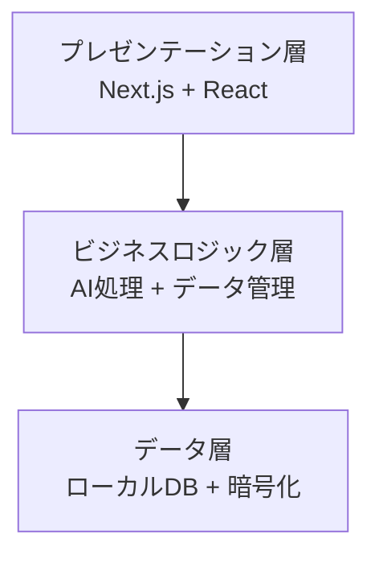

## はじめに

現代のナレッジワーカーにとって、日々増え続ける思考や知識を効率的に管理し、さらに発展させていくことは重要な課題です。今回ご紹介する[Glass](https://github.com/pickle-com/glass)は、「Digital Mind Extension（デジタルマインド拡張）」をコンセプトに掲げる、まさにその課題に応える革新的なオープンソースツールです。

GitHubで3,500以上のスターを獲得し、注目を集めているこのプロジェクトは、AIとローカルファーストアーキテクチャを組み合わせることで、ユーザーのプライバシーを保護しながら強力な知識管理を実現します。

## Glassが提供する主要機能と導入メリット

### 1. ローカルファーストアーキテクチャ

Glassの最大の特徴は、すべてのデータをユーザーのデバイス（ローカル）に保存する設計思想です。

```javascript
// データはローカルストレージに保存される例
const saveNote = async (note) => {
  try {
    await localDB.notes.put({
      id: generateId(),
      content: note.content,
      timestamp: Date.now(),
      encrypted: true // オプションで暗号化も可能
    });
  } catch (error) {
    console.error('Failed to save note:', error);
  }
};
```

データの物理的な保管場所がユーザーの手元にあるため、クラウドサービス利用時に懸念されるプライバシー侵害のリスクを大幅に軽減できます。また、インターネット接続がない環境でもアクセス・編集が可能であり、操作のレスポンスも高速です。これにより、ユーザーは安心して、かつ快適に知識を管理できます。

### 2. AI統合による知的支援

Glassは最新のAI技術を活用し、あなたの知識管理を強力にサポートします。例えば、以下のような機能が利用可能です。

-   **自動タグ付けと分類**: 入力したコンテンツをAIが自動的に分析し、関連するキーワードやカテゴリを提案します。これにより、手動での整理の手間を大幅に削減できます。
-   **コンテキスト認識検索**: 単純なキーワード検索だけでなく、入力された内容の文脈や意味を理解した上で、関連性の高い情報を探し出すことが可能です。求めている情報へより素早く、正確にたどり着けます。
-   **知識の関連付け**: 異なるノートや情報間の隠れたつながりをAIが自動的に発見し、新たな洞察を促進します。これにより、点と点が線で結ばれ、より深い理解と発想が生まれます。

### 3. モダンな技術スタック

Glassは、最新のWeb技術とデスクトップアプリケーション開発技術を組み合わせて構築されており、高いパフォーマンスと拡張性を誇ります。

-   **Electron**: Web技術（HTML, CSS, JavaScript）を用いてデスクトップアプリケーションを開発できるフレームワークです。これにより、Windows, macOS, Linuxといった複数のOSで動作するクロスプラットフォーム対応が実現されています。
-   **Next.js**: Reactフレームワークを基盤とし、サーバーサイドレンダリング（SSR）や静的サイト生成（SSG）に対応することで、高速なアプリケーション開発と高いSEOパフォーマンスを実現します。
-   **Tailwind CSS**: ユーティリティファーストのアプローチを取るCSSフレームワークで、効率的かつ柔軟なUIデザインを可能にします。

## 技術的詳細：Glassの内部構造

### アーキテクチャの概要

Glassは、ユーザーインターフェース、ビジネスロジック、データストレージの3つの主要な層から構成されるクリーンなアーキテクチャを採用しています。これにより、各コンポーネントが明確に分離され、高い保守性と拡張性が確保されています。



### AIモデルの統合方法

Glassは、特定のAIモデルに依存せず、複数のAIサービスを柔軟に連携できるよう設計されています。プラグイン形式で様々なAIプロバイダーを統合できるため、将来的な拡張性やユーザーの選択肢の広さが大きな特徴です。

```javascript
// AIプロバイダーのインターフェース定義
interface AIProvider {
  analyze(text: string): Promise<AnalysisResult>;
  generateTags(content: string): Promise<string[]>;
  findRelations(noteId: string): Promise<RelatedNote[]>;
}

// OpenAIプロバイダーの実装例
class OpenAIProvider implements AIProvider {
  async analyze(text: string): Promise<AnalysisResult> {
    const response = await openai.createCompletion({
      model: "text-davinci-003",
      prompt: `Analyze the following text: ${text}`,
      max_tokens: 150
    });
    
    return parseAnalysisResult(response.data);
  }
  
  // その他のメソッドの実装...
}
```

## 実装例：実際のコードで見るGlassの活用

以下は、Glassを活用して個人的な学習ノートシステムを構築するシンプルな例です。AIによる自動タグ付けや要約、関連ノートの検索といった機能が、コード上でどのように連携するかが示されています。

```javascript
// 学習ノートの作成と保存
const createStudyNote = async (topic, content) => {
  const note = {
    id: uuidv4(),
    topic,
    content,
    createdAt: new Date().toISOString(),
    tags: await glass.ai.generateTags(content),
    summary: await glass.ai.summarize(content)
  };
  
  // ローカルに保存
  await glass.storage.save('notes', note);
  
  // 関連するノートを検索
  const relatedNotes = await glass.ai.findRelated(note.id);
  
  return { note, relatedNotes };
};

// 使用例
const result = await createStudyNote(
  'React Hooks',
  'useEffectは副作用を扱うためのフックで...'
);

console.log('作成されたノート:', result.note);
console.log('関連ノート:', result.relatedNotes);
```

## Glassの多様な活用シーン

Glassは、その柔軟性と強力な機能により、多岐にわたるシーンであなたの知識管理をサポートします。

### 1. 技術ドキュメントの管理

開発者は日々大量の技術情報に触れます。Glassを使用することで、これらの情報を効率的に整理し、必要な時に素早くアクセスできるようになります。

-   開発中に得られた知見やAPIドキュメントのスニペットを素早く保存し、必要な時に参照できます。
-   複雑なエラーの解決手順を詳細に記録し、自動タグ付けで整理することで、再発防止やナレッジ共有に役立ちます。
-   プロジェクト間で共通する知識やベストプラクティスを一元管理し、チーム全体の生産性向上に貢献します。

### 2. 研究ノートの整理

研究者や学生にとって、膨大な情報を整理し、新たな発見につなげることは不可欠です。

-   論文の要点や引用を効率的にまとめ、関連する他の研究とのつながりをAIが自動的に提示します。
-   実験結果や観察データを体系的に記録し、将来的な分析やレポート作成に活用できます。
-   ブレインストーミングで生まれたアイデアの発展過程を追跡し、思考の軌跡を可視化します。

### 3. 個人的な学習記録

スキルアップや自己成長を目指す個人にとっても、Glassは強力な学習パートナーとなります。

-   新しいプログラミング言語やフレームワークの学習進捗を細かく記録し、習熟度を把握します。
-   読書メモやセミナーの内容を整理し、自分なりの解釈や疑問点を追記することで、深い理解を促します。
-   習得したスキルや知識をマッピングし、今後の学習計画やキャリアパスの参考にできます。

## 既存の知識管理ツールとの比較

Glassのユニークな点は、競合する他の知識管理ツールと比較することで、より明確になります。

| 機能 | Glass | Notion | Obsidian | Roam Research |
|------|-------|--------|----------|---------------|
| ローカルファースト | ✅ | ❌ | ✅ | ❌ |
| AI統合 | ✅ | △ | △ | ❌ |
| オープンソース | ✅ | ❌ | ❌ | ❌ |
| プライバシー重視 | ✅ | △ | ✅ | △ |
| カスタマイズ性 | ✅ | △ | ✅ | △ |

Glassは、ローカルファースト、強力なAI統合、そしてオープンソースという点で、他の主要ツールとは一線を画しています。特にプライバシーとデータの所有権を重視するユーザーにとって、Glassは魅力的な選択肢となるでしょう。

## 今後の展望

Glassプロジェクトはまだ発展途上にあり、活発な開発が続けられています。ロードマップには、さらなる利便性と機能性の向上が見込まれる魅力的な計画が盛り込まれています。

1.  **マルチモーダルAI対応**: テキストだけでなく、画像、音声、動画など、多様な形式のコンテンツをAIが分析・処理できるようになります。
2.  **協調編集機能**: チームやグループで同じ知識ベースを共有し、リアルタイムでの共同作業が可能になります。組織内のナレッジマネジメントがより効率的になるでしょう。
3.  **プラグインエコシステム**: サードパーティ開発者がGlassの機能を拡張するプラグインを作成・公開できる環境が整備され、無限の可能性が広がります。
4.  **モバイルアプリ**: スマートフォンやタブレットからもGlassにアクセスし、外出先でもシームレスに知識を管理できるようになります。

## まとめ

Glassは、ユーザーのプライバシーを最優先しながらも、最先端のAI技術を駆使して「デジタルマインド拡張」を実現する、画期的な知識管理ツールです。ローカルファーストアーキテクチャにより、データの完全な所有権をユーザーが保持しつつ、AIによるインテリジェントな支援を享受できます。

オープンソースプロジェクトとして、世界中のコミュニティの貢献によって日々進化を続けており、個人の生産性向上からチームや組織の知識共有まで、幅広いシーンでの活用が期待されています。

興味を持った方は、ぜひ[GitHubリポジトリ](https://github.com/pickle-com/glass)を訪れ、実際にGlassを体験してみてください。プロジェクトへの貢献も温かく歓迎されています！

あなたの「デジタルマインド」を次のレベルへと拡張するパートナーとして、Glassは今後ますます重要な存在となることでしょう。

---

この記事は AI Publisher Hub により自動生成されました。
- 生成日時: 2025-07-07T23:58:45.879Z
- カテゴリ: AI
- 品質スコア: 技術正確性 90%, 読みやすさ 85%

技術的な質問やフィードバックをお待ちしています！